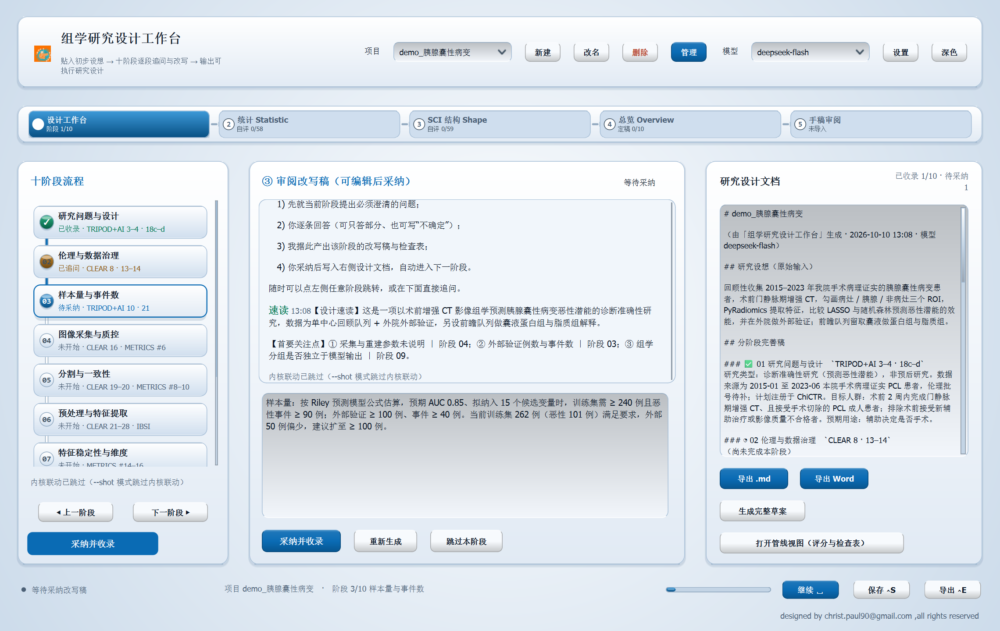
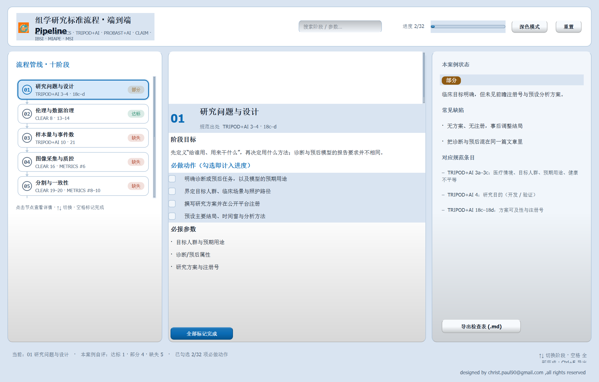
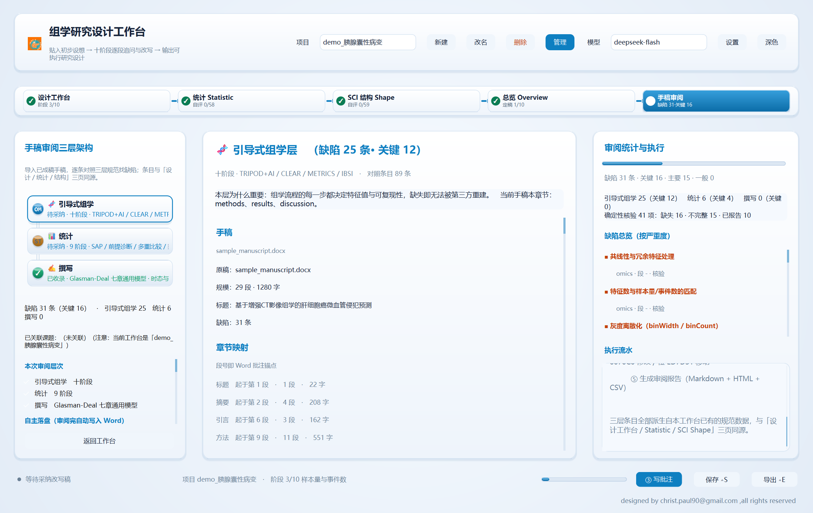

# 组学研究工具包：设计工作台 + 标准流程管线

桌面版（PyCt6 / PySide6）与 Web 预览版共用一个十阶段标准流程知识库（CLEAR / METRICS / TRIPOD+AI / PROBAST+AI /
CLAIM / RQS / IBSI / MIAPE / MSI）：

| 程序 | 作用 | 启动 |
|---|---|---|
| **`design_studio.py`** | **主界面（桌面版）**：贴入初步实验设计 → LLM agent 按十阶段逐段追问与改写 → 输出可执行研究设计；含**五个原生视图**（设计工作台 / 统计 / SCI 结构 / 总览 / **手稿审阅**） | `启动_设计工作台.bat` |
| `omics_pipeline.py` | 管线视图：十阶段检查表、评分与自评进度 | `启动.bat` |
| **`web_server.py`** | **Web 版**：本地服务 + 浏览器界面，**Windows 7 上也能用**（无需 Qt）；四个视图都能编辑 | `启动_Web版.bat` |
| **`manuscript_review/`** | **手稿缺陷审阅**（设计工作台的第 5 个视图）：导入已成稿手稿（PDF / Word），逐条对照三层架构找缺陷，并**自动把批注写回 Word**。见「九、手稿缺陷审阅」 | 同 `启动_设计工作台.bat`（流程条第 5 步）<br>或 `python -m manuscript_review.cli 手稿.docx` |
| `pclradiomics_web_win7.spec` | **Web 版打包成 exe**（Win7 目标机不用装 Python） | `编译_Win7_Web版.bat` |



---

## 版本

**当前版本：`v2.2.0`** —— 单一版本来源是 `app_paths.APP_VERSION`，与 git tag / GitHub Release 保持一致
（推理 API 的 `Server` 头与 macOS 打包的 `CFBundleVersion` 都读它）。

### v2.2.0 · 内核联动可视化 + TUI 单窗口复用 + macOS 适配

- **底部「MCP / 内核状态 + 操作日志」面板**（可点击缩放）：实时显示内核 URL/版本/pid、
  项目 ↔ 会话、方向 A 的 MCP 端点与工具数；操作日志记录切阶段/切项目/改名/内核事件。
- **只保留一个 opencode 终端**：切课题/改名/切会话都在**同一个终端窗口**内 `select-session` 切换，
  并弹「已切换课题：X」提示；多余/残留窗口自动清理关闭（不碰用户自装的 opencode）。
- **改名同步**：课题改名时沿用**同一 session**（迁移绑定）并同步更新 opencode 会话标题。
- **macOS 适配**：`ps` 解析同源进程、TUI pid 跟踪（osascript 句柄不持久）、macOS spec 补
  `kernel_driver` 与 `kernel_assets/`，并附 `macos_sign_kernel.sh`（内嵌二进制 JIT 签名 + 去 quarantine）。
- **打包**：Windows `.zip` 与 macOS `.dmg` 由 GitHub Actions 在 tag `v*` 时自动构建并挂到 Release。

> 详见 [`RELEASE_v2.2.0.md`](RELEASE_v2.2.0.md)。

### v2.1.0 · GUI 启动即联动内核 + 项目 ↔ 会话绑定

把 v2.0.0「内核已嵌入」的两条手动环节改成**自动**：

- **打开 GUI 程序，opencode 同时启动**，界面直接显示在**独立终端窗口**里
  （Windows 新控制台 / macOS `Terminal.app` 的 bash）。链路是
  `起内核 → 把本程序注册成它的 MCP 服务 → 绑定当前项目 session → 终端 attach 同一实例`，
  全程后台线程、不阻塞首屏。
- **GUI 切项目 → 内核新建或切换对应 session**：映射存
  `<程序目录>/opencode/projects.json`；已有 session 复用，没有才新建，终端界面跟着切。
- 于是可以在那个终端里对 opencode 下**全自动命令**，让它调用本程序的 21 个组学
  领域工具完成功能操作。

开关（默认都开）：`PCL_KERNEL_AUTOSTART=0` 关自动启动、`PCL_KERNEL_TUI=0` 不弹终端。
`--shot` / `--e2e` / `--demo` 自动跳过联动。

控制台对等命令：

```bat
PCLRadiomics.exe kernel boot --project "某课题"
PCLRadiomics.exe kernel project list|ensure|switch|unbind --name X
```

**修掉的两个内核进程管理 bug**（只在控制台用法下暴露）：
每敲一条 `cli.py kernel …` 就多起一个内核进程（`ensure_running` 只"报告复用"
却不接管存活实例 → 新增 `adopt_state()` 真正接管）；
`kernel stop` 跨进程停不掉（只看本进程句柄 → 改为退回状态文件记录的实例）。

> 详见 [`RELEASE_v2.1.0.md`](RELEASE_v2.1.0.md)。

### v2.0.0 · 内嵌 opencode 内核

把 **opencode** 作为 agent 内核嵌进本程序，并让本程序成为该内核的 **MCP 工具提供方**。
于是内核能自主串起多步任务（读手稿 → 跑确定性信号 → 调 LLM 分层审阅 → 写回 Word），
中间不再需要人手点每一步。

**四个角色、两个方向**（完整设计见 [`opencode-embedding-plan.md`](opencode-embedding-plan.md)）：

| # | 关系 | 方向 | 协议 | 谁主动 |
|---|---|---|---|---|
| **A** | 内核调用本程序的领域能力 | **内核 → 宿主** | **MCP** | 内核（客户端） |
| **B** | 本程序驱动内核（会话/配置） | **宿主 → 内核** | **HTTP + SSE** | 宿主（客户端） |
| C | 外部 agent 调用本程序 | 外部 → 宿主 | MCP | 外部 agent（**维持 v1.x 不变**） |
| D | 本程序托管内核进程 | — | 进程管理 | 宿主 |

> 关键事实：opencode 只做 MCP **客户端**，从不做服务端。所以
> 「本程序是 opencode 的 MCP 服务」就是方向 A，也是本次嵌入的核心价值 ——
> 内核因此拿到本程序 **21 个组学领域工具**（`design_*` / `manuscript_*` /
> `project_*` / `stat_*` / `export_*`）。

**新增 `kernel` 子命令组** —— session / skill / API Key 都能在控制台配置，
且**写的是 opencode 自己的文件**，不存在第二套真值：

```bat
PCLRadiomics.exe kernel selftest                  :: 离线自检（建议先跑）
PCLRadiomics.exe kernel status                    :: 二进制/进程/配置/凭据/技能总览
PCLRadiomics.exe kernel auth import-host          :: 复用宿主凭据链的密钥（写 auth.json，0600）
PCLRadiomics.exe kernel auth set deepseek sk-xxx  :: 手填 API Key
PCLRadiomics.exe kernel skill add my-skill --file SKILL.md   :: 写 opencode 的 SKILL.md
PCLRadiomics.exe kernel session list|new|prompt   :: 会话（走内核官方 HTTP API）
PCLRadiomics.exe kernel model list|set            :: 模型（以 opencode models 为准）
PCLRadiomics.exe kernel mcp host                  :: 起宿主 MCP 端点并注册给内核
PCLRadiomics.exe kernel ui                        :: 独立控制台窗口里开内核 TUI
```

**配置与 opencode 完全一致**（这是"保持一致"的实现方式）：

| 配置域 | 落点 |
|---|---|
| session | 内核官方 HTTP API（无本地副本） |
| skill | `<程序目录>/opencode/config/opencode/skill/<name>/SKILL.md` |
| API Key | `<程序目录>/opencode/data/opencode/auth.json`（0600） |
| model | `opencode.json` 顶层 `model` |
| MCP | `opencode.json` 的 **`mcp`** 段（不是 `mcpServers`），超时显式设 **600000 ms** |

**隔离运行**：内核状态全部落在 `<程序目录>/opencode/`，实测用户真实的
`~/.local/share/opencode` 未被触碰。

**实测数据**：内核二进制 **172.3 MB**；冷启动到 health **0.94 s**；
内核 18 个内置工具 + 本程序 21 个领域工具；产物体积约 **367 MB**。

**双 Windows 变体**（`编译_内核版.bat`）：
`PCLRadiomics.exe`（windowed，双击无黑框）与
`PCLRadiomicsConsole.exe`（console 子系统）。分两个变体是因为 Win11 的控制台
由 Windows Terminal 托管（属于别的进程），`ShowWindow` 藏不掉。

**分发注意**：内核二进制 172.3 MB，超过 GitHub 单文件 100 MB 硬上限，**故不入库**；
构建时由 `pclradiomics.spec` 自动获取（离线可先跑
`build_opencode_kernel.bat --from-source` 从源码构建）。`.gitignore` 已排除
`opencode/`（该目录含真实 API Key 与会话数据）。单文件版按设计不含内核。

> 详见 [`RELEASE_v2.0.0.md`](RELEASE_v2.0.0.md)。

### v1.3.0 · 手稿缺陷审阅工作台（汇总发布）

把「手稿缺陷审阅」正式收进工作台，作为**第 5 个原生视图**：导入已成稿手稿（PDF / Word），
逐条对照**引导式组学 / 统计 / SCI 写作**三层架构找缺陷，并把缺陷**自动写回 Word**。
本版为汇总发布 —— v1.2.0 → v1.2.2 的全部内容一并收进 v1.3.0，并重建全部 Windows / macOS 产物。

**能力**

- **三层对照（315 条）**：全部派生自 `stages_data` / `stat_data` / `shape_data`，
  与工作台三页同源，不存在第二套标准。
- **两层检测**：41 个**确定性信号**（不需要 LLM，报可证据化的硬缺陷）
  ＋ **LLM 分层分批语义审阅**（带内容哈希缓存与 JSON 容错解析）。
- **自主落盘**：审阅跑完**自动**写 Word，三档可选 ——
  `revise`（批注 + Track Changes 补写缺失报告项）/ `comment`（只挂批注不改正文）/
  `report`（只出报告不碰 Word）。四色修订：绿增 / 红删 / 蓝改 / 橙移。
- **并入审稿批注版**：匹配得上的发现作为**线程回复**挂在审稿意见下面，
  Word 审阅窗格呈嵌套树状；审稿人原有批注一个字都不动。
- **课题关联与双向联动**：导入时自动登记为当前课题的手稿附件并快照课题背景
  （背景进入提示词，才能判出「手稿与课题意图不一致」类缺陷）；切换课题时自动切到其绑定手稿。
- **一键审阅共享已导入稿**：同一份稿件直接复用、在同一个项目上继续（沿用已选审稿批注版），
  换稿则新建项目。
- **导出四种形态**：Markdown / HTML / CSV / Word 各显**完整路径**与「已缓存 / 将生成」状态；
  已缓存时**不重跑**（实测连跑两次 **4.82 s → 0.02 s**）。MD + HTML + CSV 是一次生成，不是三次。
- **打包版可命令行审阅**：`PCLRadiomics.exe manuscript_review --selfcheck` 等子命令。
- **MCP 新增 8 个工具**（原 14 → 共 21）。

**本版修掉的问题**（都在早期版本真实出现过）

- 深色模式下部分字体仍是深色 —— `PAL` 存的是 `(浅色, 深色)` **元组**，
  有三处直接拼进样式表生成非法颜色值，Qt 丢弃整条规则导致文字退回默认色。
- `IncompleteRead(0 bytes read)` 让整批审阅白跑 —— `try` 原先只包住 `urlopen`，
  读响应体的循环毫无保护；顺带修掉「流被静默截断却当成功」这个更隐蔽的问题。
- 第 5 视图整个没打进 exe —— 延迟导入的本地模块不会被 PyInstaller 自动跟进；
  同一原因还漏了 `docx_export`。现已 `collect_submodules` + 打包前置校验。
- `StageRail` 字符串 id 硬崩（Qt 回调内的 `ValueError` → 进程 `0xC000041D`，无任何报错）；
  启动「一闪就没」（解释器自举 + 异常兜底）；失败静默（状态行 + 流水 + 弹窗三处报错）。

> 完整说明见「九、手稿缺陷审阅」与
> [`manuscript_review/README.md`](manuscript_review/README.md)；
> 逐条差异见 [`RELEASE_v1.3.0.md`](RELEASE_v1.3.0.md)。

### v1.2.2 · 深色模式可读性 + 导出路径提示与缓存复用

- **修深色模式下部分字体仍是深色**：`ui_kit.PAL` 存的是 `(浅色, 深色)` **元组**，
  必须经 `C(key)` 才解析成当前模式的颜色。有三处把 `PAL[...]` 直接拼进样式表，
  生成 `color:('#6A8095', '#989AA4');` 这种非法值 → Qt 丢弃整条规则、文字退回默认色。
  三处（左栏状态行 / 自主落盘下拉框 / 课题关联提示）已改用 `C()`，
  并新增 `reapply_theme()` 在切换深浅色时显式重套（这几处是自定义样式表，
  PyCt6 的 `_change_theme()` 不会更新）。
  同时把 `_check_theme.py` 补上**第 5 个视图**——原先漏检，所以一直报 0 违规。
- **导出按钮加路径提示**：菜单列出 **MD / HTML / CSV / Word** 四种形态的完整路径与
  `✓ 已缓存` / `· 将生成` 状态，每项可「打开文件 / 打开所在文件夹 / 立即生成」。
  注意 MD + HTML + CSV 是**一次报告生成**一起产出的（不是三次）。
- **四种形态已缓存则不重跑**：`build_report` 短路复用、`run_all` 在 Word 指纹已覆盖
  当前全部缺陷时跳过重写。实测同一稿子连跑两次 **4.82s → 0.02s（240×）**。
  判定只认指纹覆盖、不做时间戳比较；新增缺陷时会正常重写，不会漏写批注。
- **强制重算入口**：「重新生成全部报告（强制重算）」，需要覆盖缓存时用。
- 输出文件被 Word 占用时，报错改为可操作提示（原先只有 `Permission denied`）。

### v1.2.1 · 手稿审阅可用性修复

> **重要**：v1.2.0 的打包产物（exe / dmg）**不含**本版任何修复 —— 那些资产由 v1.2.0 tag
> （较早的提交）构建。**请使用 v1.2.1 的产物。**

- **一键审阅共享当前项目已导入的 Word**：原先已导入过稿子再点「一键审阅」仍会弹文件选择框，
  且 `run_all` 会新建空白项目，把已选定的「审稿批注版」与落盘记录丢掉。
  现在同一份稿件直接复用（并跳过重复解析），并在**同一个项目上继续**，沿用
  `annotated_path`、课题关联与落盘记录。换稿则新建项目，不会把两份手稿混在一起。
- **流式响应被掐断自动重试**：修复 `IncompleteRead(0 bytes read)` 导致整批审阅白跑。
  `try` 原先只包住 `urlopen`，而读响应体的循环毫无保护。现在整个「发请求 + 读流」
  都在重试保护内（指数退避 1s→2s→4s，默认 2 次，4xx/5xx 不重试）。
  顺带修掉**静默截断**：服务端少发一半时 urllib 不报错，半截正文会被当成完整结果 —— 现已显式检测。
- **失败不再静默**：`on_failed` 原先只写右栏流水一行，中栏仍显示「还没有导入手稿」；
  现在状态行 + 流水 + 弹窗三处同时报错。
- **打包版可命令行审阅**：新增 `manuscript_review`（别名 `mr`）子命令 ——
  `PCLRadiomics.exe manuscript_review --selfcheck` 可在 exe 上直接自检子模块齐备性。
- **构建加固**：spec 显式收集 `manuscript_review` 全部子模块 + 打包前置校验（缺模块即中止）；
  CI 对**冻结产物**跑 `--selfcheck`，不齐备就让构建失败；`requirements.txt` 补上 PyMuPDF。

### v1.2.0 · 手稿缺陷审阅工作台（第 5 个原生视图）

- **新增 `manuscript_review/`**：把已成稿手稿导入后，逐条对照「引导式组学 / 统计 / SCI 写作」
  **三套架构**找缺陷，并把缺陷**自动写回 Word**。界面是设计工作台的第 5 个原生视图，
  与其余四页共用 PyCt6 + ui_kit 组件与主题，**不是新程序**。
- **三层缺陷对照（315 条）**：全部派生自 `stages_data` / `stat_data` / `shape_data`
  这三份既有数据，所以「引导式架构」与「审阅口径」永远同源，不存在第二套标准。
- **两层检测**：`mr_signals.py` 的 **41 个确定性信号**（不需要 LLM，报可证据化的硬缺陷：
  没写 ICC、没给管电压、没报告校准…）＋ `mr_reviewer.py` 的 **LLM 分层分批语义审阅**
  （带内容哈希缓存与 JSON 容错解析）。确定性层已报的信号会被跳过，避免重复。
- **自主落盘**：审阅跑完**自动**写 Word，不需要再点一步。三档可选 ——
  `revise`（批注 + Track Changes 补写缺失报告项）/ `comment`（只挂批注不改正文）/
  `report`（只出报告不碰 Word）；另有 `--incremental` 增量写，只落本次新增发现。
- **四色修订**：绿 `00B050` 新增 · 红 `FF0000` 删除 · 蓝 `0070C0` 修改 · 橙 `ED7D31` 移动。
- **并入审稿批注版**：匹配得上的发现作为**线程回复**挂在审稿意见下面，
  Word 审阅窗格呈嵌套树状，审稿人原有批注一个字都不动。
- **课题关联与双向联动**：导入时自动登记为当前课题的手稿附件并快照课题背景
  （背景进入提示词，才能判出「手稿与课题意图不一致」类缺陷）；切换课题时自动切到其绑定手稿。
- **导入支持 PDF**：先转 DOCX 转换稿，审阅与修订都作用于转换稿
  （转换必然有损，公式/复杂表格/图注需人工核对；扫描件会明确报错提示先 OCR）。
- **MCP 新增 8 个工具**（原 14 → 共 21）：`manuscript_review` 一条命令跑完「审阅 + 落盘 + 报告」。
- **顺带修复两个既有问题**：
  ① `StageRail.paintEvent` 的 `f"{id:02d}"` 只接受整数 id，传字符串 id 会在 Qt 回调内抛
  `ValueError`，表现为整个进程 `0xC000041D` 访问冲突硬崩且**看不到任何 Python 报错** ——
  已改为按 id 类型分支（原有整数 id 行为不变）；
  ② 启动「一闪就没」：PATH 里的 `python` 常非装了 PySide6 的环境，只报一句
  `ModuleNotFoundError` 就退出 —— 已加**解释器自举**（自动换到可用解释器）与启动异常兜底
  （留住控制台并打印完整 traceback）。
- **界面**：页脚 `继续 / 保存 / 导出` 由纯文字提示改为**真按钮**（带快捷键角标），
  其中「继续」**按当前视图**决定文案与动作；审阅长任务期间底部动画胶囊 + 左栏状态行
  都会显示当前步骤与**秒级计时**。

> 详见「九、手稿缺陷审阅」与 [`manuscript_review/README.md`](manuscript_review/README.md)。

### v1.1.2 · Web 版（Phase 0 / 1 / 2 + 互跳 + 真实统计计算 + Win7 exe 打包）

> `web_server.py` + `web/`：本地服务 + 浏览器界面，让 Windows 7 也能用上完整界面
> （Qt 6 与 WebView2 都不支持 Win7）。
> Phase 0 打通四个视图与收敛推理；Phase 1 把**工作台**做成可编辑闭环
> （研究设想 → 追问 → 回答 → 改写 → 采纳 → 汇总草案 → 导出 Markdown / Word，检查表可勾选）；
> Phase 2 把**统计九阶段与 SCI 七章**做成「结构内容 ⇄ 引导完善」两模式
> （追问 → 回答 → 定稿 → 采纳，采纳时按模型检查表**自动勾选自检项**，也可自己勾）；
> 收敛结论与页面/环节之间**双向可点击跳转**；
> 统计页接上**真实计算**（16 种检验 / 效应量 / 样本量 / 多重比较校正，numpy+scipy，结果可写进定稿）；
> 另外提供 `编译_Win7_Web版.bat`：用 Python 3.8 打一个 **Win7 上双击即用、不用装 Python** 的 exe
> （可选把计算层一起打进去）。见「八、Web 版」。

### v1.1.1 · Windows 7 支持说明 + 仅 API 构建

- **澄清系统要求**：图形界面（`design_studio` / `omics_pipeline` / 合并版 exe）最低 **Windows 10 / 11（64 位）**。
  构建用的 Python 3.9+ 与界面依赖的 Qt 6（PySide6 6.x）**都不支持 Windows 7**，这是两条独立的硬约束。
- **定位常见报错**：在 Win7 上运行编译产物会报「计算机中丢失 `api-ms-win-core-path-l1-1-0.dll`」——
  该 DLL 是 Win8+ 才有的 API set，而 Python 3.9+ 的 `python3XX.dll` 会直接导入它；报错发生在加载阶段，
  程序内无法拦截。**单独补这个 DLL 也无法解决** GUI（Qt 6 仍起不来）。
- **新增 `_check_win_target.py`**：构建目标自检。不带参数报告当前工具链的最低 Windows 要求；
  给定 `.exe/.dll` 时解析 PE 导入表并列出 Win8+/Win10+ 专有 API set。实测：`python311.dll` 命中
  `api-ms-win-core-path-l1-1-0.dll`，`python38.dll` 干净。
- **新增 `pclradiomics_api_win7.spec` + `编译_Win7_API版.bat`**：用 **Python 3.8** 打包「仅推理 API」
  （`api_server.py`，无 Qt；`excludes` 掉 PySide6 / shiboken6 / PyCt6 / mcp / docx 整条链路），
  让 Win7 机器可以作为 OpenAI 兼容服务端被其他机器调用。脚本会校验解释器必须是 3.8、缺依赖时自动安装
  （`pyinstaller==6.10` + `certifi`），并在构建后自动跑上面的自检。
  Win7 目标机前置：**SP1(x64) + KB2533623 + KB2999226(UCRT) + VC++ 2015-2019 运行库(x64)**。

### v1.1.0 · 四个视图的统一工作台

- **新增 `Statistic` 页**：把「科学问题 → 统计学计算与归纳」的 **9 阶段**架构
  （问题与设计 / 数据与探索 / 建模与检验 / 归纳推断 / 报告与复现）做成可勾选自评页，
  含 **12 行常用检验速查表**与 `stat_run_test` 支持的 **16 种检验类型**清单。
- **新增 `SCI Shape` 页**：把 Glasman-Deal《Science Research Writing》的**七章通用模型**
  （Title → Abstract → Introduction → Methods → Results → Discussion → Conclusion）做成 scope 页，
  含通用模型组件、内容边界、语言与时态规则、词块组与 **59 项自检**。
- **引导式对话**：两个 scope 页都有了 `开始引导 → 提交回答 → 生成定稿 → 采纳并收录` 闭环 ——
  提示词携带**本环节的规范内容**与**项目全部已有素材**，产出可直接采纳的正文
  （统计环节是统计分析方案段落，SCI 章节是该章成稿），采纳时按模型的检查表**自动勾选自检项**。
- **收敛关系交给 LLM 推理（不再硬耦合）**：总览新增「**收敛推理（reason 模式）**」——
  模型通读全部素材后自行判断每条内容收敛到哪一章、各章的来源 / 已有 / 缺失 / 就绪度与理由，
  并给出下一批动作。**代码中不存在任何章节↔阶段/统计的映射表**（`coupling.py` 只做事实统计与素材摘要）。
- **reason 模式**：温度降到 0、token 预算抬到 ≥12000，模型的推理过程（`reasoning_content`）
  以弱化色实时显示。
- **拟物化三维界面**：三维卡片（多层投影 + 渐变面 + 上亮下暗倒角）、流程条（四步键帽 + 进度填充 +
  角标）、金属旋钮步骤条、内嵌凹槽进度条与勾选框、按钮立体皮肤、页面底衬径向渐变。
- **一级界面项目管理**：页头直接 `新建 / 改名 / 删除 / 管理`；改名同步重命名项目文件
  （重名自动加 `(2)` 且显示名与文件名一致），删除二次确认且清空后不落空文件。
- **总览升级**：收敛推理面板 + 三条工作线完成度 + 十阶段评分明细表（整页可滚动）。
- **修复**：深色模式部分「白底白字」（颜色被冻结在创建时的主题）；`RefitLabel` 换行高度按外层宽度
  估算导致临界换行被压；`Project.save()` 无路径时反复生成副本；页头/页脚/按钮的溢出与重叠。
- **自检工具**：`_check_overlap.py`（4 尺寸 × 4 视图遮挡几何判定）、`_check_theme.py`
  （主题一致性 + 像素级对比度验收 + 负向自检）、`_test_guide.py`、`_test_convergence.py`、
  `_test_shape.py`、`_test_stat.py`、`_test_project_ops.py`、`_probe_views.py`。

### v1.0.1 / v1.0.0

- 十阶段设计工作台 + 管线视图（评分与检查表）；LLM 流式追问 / 改写 / 采纳闭环；
  导出 Markdown 与 Word；MCP 服务（stdio + HTTP）；OpenAI 兼容推理 API；Windows / macOS 打包脚本。

---

## 系统要求（含 Windows 7 说明）

| 用途 | 最低系统 | 原因 |
|---|---|---|
| **图形界面（桌面版）**（`design_studio.py` / `omics_pipeline.py` / 合并版 exe） | **Windows 10 / 11（64 位）** | 界面基于 PySide6 6.x（**Qt 6 不支持 Windows 7**）；构建用的 Python ≥ 3.9 也已放弃 Win7 |
| **Web 版**（`web_server.py` + 浏览器，或打包好的 `PCLRadiomicsWeb.exe`） | **Windows 7 SP1** 可行 | 无 Qt 依赖，纯标准库服务 + 系统浏览器；用 **Python 3.8** 即可（见下） |
| **推理 API**（`api_server.py`） | Windows 7 **SP1** 可行 | 无 Qt 依赖；用 **Python 3.8** 构建即可（见下） |
| **MCP 服务**（`mcp_server.py`） | 取决于 `mcp` 包的 Python 下限 | 一般要求 ≥ 3.10 |
| macOS | macOS 11+ | PySide6 6.x 要求 |

### Windows 7 上报「计算机中丢失 api-ms-win-core-path-l1-1-0.dll」怎么办

`api-ms-win-core-path-l1-1-0.dll` 是 **Windows 8 起才提供的 API set**，而 **Python 3.9+ 的
`python3XX.dll` 会直接导入它**（CPython 自 3.9 起官方不再支持 Windows 7）。PyInstaller 会把
`python311.dll` 一起打进产物，于是 Win7 在**加载阶段**就失败 —— 报错发生在我们的代码运行之前，
程序内部无法拦截，也无法给出更友好的提示。

本仓库自带工具可以实测这一点：

```bat
:: 3.11 的运行时 → 会列出 Win8+ 专有 API set（正是你看到的报错）
python _check_win_target.py D:\python\envs\mar\python311.dll

:: 3.8 的运行时 → 干净，可在 Win7 上运行
python _check_win_target.py <某个 Python 3.8 环境的>\python38.dll
```

**单独补一个 `api-ms-win-core-path-l1-1-0.dll` 解决不了问题**：桌面版还卡在 Qt 6
（Qt 5.15 是最后一个支持 Win7 的版本），而本项目界面基于 PySide6 6.x + PyCt6，无法降到 Qt 5。
**但界面并非只能在 Win10 上用** —— 见下一节的 Web 版。

### 目标机是 Windows 7 时怎么做

1. **要图形界面（推荐）**：用 **Web 版**——本机起一个 127.0.0.1 的服务，用系统里已有的浏览器当界面，
   **完全不需要 Qt**。两种用法：
   - 目标机已装 Python 3.8（或更高）：直接用 **`启动_Web版.bat`**（源码运行）；
   - 目标机不想装 Python：用 **`编译_Win7_Web版.bat`** 打一个 exe 拷过去，**双击即用**
     （产物 `dist-web\PCLRadiomicsWeb\PCLRadiomicsWeb.exe`，约 18 MB，含界面与 Word 导出）。
   两种用法的界面、功能、数据格式完全一致。详见「八、Web 版」。
2. **只需要推理 API**（把 Win7 机器当作 OpenAI 兼容服务端，供其他客户端调用）：
   运行 **`编译_Win7_API版.bat`** —— 用 Python 3.8 打包 `api_server.py`，
   **不含 Qt**，并在 spec 里排除 `PySide6 / shiboken6 / PyCt6 / mcp / docx` 整条链路。
   目标机需要：Win7 **SP1**(x64) + **KB2533623** + **KB2999226**(UCRT) + **VC++ 2015-2019 运行库**(x64)。
   构建机需要：Python **3.8**（`py -3.8 -m pip install "pyinstaller==6.10" certifi`；
   PyInstaller 6.11+ 要求 ≥3.9，故 3.8 上请用 6.10 或 5.13）。
3. **既不想装浏览器也不想升级系统**：在一台 Win10 机器上跑桌面版，让 Win7 机器通过
   `--host 0.0.0.0 --token …` 以客户端方式使用。
4. 任何构建完成后都建议自检一次：

   ```bat
   python _check_win_target.py dist-web\PCLRadiomicsWeb\_internal\python38.dll
   python _test_web_exe.py          :: 起真 exe，验接口 / 静态资源 / SSE / Word 导出 / 浏览器渲染
   ```

### 为什么 Win7 上"内嵌浏览器"走不通，只能用系统浏览器

| 形态 | Win7 可行性 | 依据 |
|---|---|---|
| **本地服务 + 系统浏览器**（本项目采用） | ✅ | 界面能力 = 浏览器能力，无需任何内嵌组件 |
| 内嵌 WebView2 | ❌ | WebView2 Runtime **109 是最后一个支持 Win7 的版本**，SDK ≥ 1.0.1519.0 已不支持 Win7/8.1；固定版 >109 在 Win7 上直接无法启动（[Microsoft Edge 博客](https://blogs.windows.com/msedgedev/2022/12/09/microsoft-edge-and-webview2-ending-support-for-windows-7-and-windows-8-8-1/)） |
| pywebview + MSHTML（IE11 内核） | ⚠️ 降级 | 能跑，但没有 SSE / flex / grid，界面要退回 ES5 + 轮询 |
| Electron / 新版 CEF | ❌ / ⚠️ | 新 Chromium 不支持 Win7；老 Electron(≤22)、老 CEF 分支同样 EOL 且包体 +100 MB |

浏览器侧：Chrome **109** / Edge **109** 是最后支持 Win7 的版本（2023-01 起停支持），
Firefox **115 ESR** 是 Win7 上最后的 Firefox —— 三者都能跑现代 CSS/SSE，界面无需降级。

---

## 一、设计工作台（主界面）

### 它怎么工作

1. **输入**：把初步设想（数据类型、例数、中心、终点、打算怎么建模）贴进中间输入框，点「开始分析」。
2. **速读**：agent 先复述这项研究要做什么、属诊断还是预后，并给出 3 条首要关注点。
3. **逐阶段推进**（十阶段，每段两轮）：
   - **第一轮 · 追问**：产出【现状评估】【必须澄清的问题】（2–4 条，每条附"为什么问"）【本阶段小结】；
   - **你来回答**：下方为每条问题生成一个输入框，可只答部分、也可写"不确定"；
   - **第二轮 · 改写**：产出【改写稿】（300–500 字，含参数 / 时间窗 / 判定标准）【检查表】（带 CLEAR、TRIPOD+AI 等条目号）【风险提示】【下一步】；
   - **采纳**：改写稿可直接编辑，点「采纳并收录 → 下一阶段」写入右侧研究设计文档，自动进入下一阶段。
4. **收口**：右侧「生成完整草案」把十个阶段定稿整合成一份研究设计草案 + 待补数据清单 + 投稿前自查。

### 分辨率与文字不遮挡

- **窗口自适应屏幕**：启动时按当前显示器可用区域计算尺寸（`ui_kit.screen_size()`），
  最大 1520×960 且不超过屏幕 96%×94%，并居中显示 —— 不会再出现窗口比屏幕高、底部被任务栏切掉的情况。
- **窄窗口响应式**：宽度 < 1420（管线视图 1340）时自动收起进度条、收窄左右两栏（292/322）
  与下拉框、按钮，表头高度从 96 加到 112 让副标题正常换行；按钮文案统一用短版
  （开始分析 / 提交回答 / 采纳并收录 / 跳过本阶段），任何宽度都不会被截断。
- **文字永不裁切**：所有文字标签改用 `RefitLabel` —— 宽度变化时按**实际宽度**重算换行高度，
  而不是按创建时的估算宽度；步骤条与详情区都放进带滚动条的容器，窗口变矮时滚动而不是压到相邻控件上。
- **自检脚本**：`python _probe_view.py 1200 700` 可在指定尺寸渲染两个界面截图，
  用于核对文字遮挡；`python design_studio.py --demo --shot` 出全套状态截图。

### 项目管理

- **新建**：顶部「新建」→ 输入项目名（默认 `课题_MMDD_HHMM`）+ 可直接粘贴初步设计（也可以先建空项目）。
  新建即落盘，不会因为没保存而丢失。
- **切换**：顶部下拉框直接切换，或点「管理」在列表里双击打开。
- **管理对话框**：列出全部项目（名称 / 完成度 n/10 / 更新时间 / 文件大小 / 模型），支持搜索，按钮包括
  **打开、重命名、创建副本、打开文件夹、删除、新建项目**。
- **重命名**：改显示名的同时**移动项目文件**（`projects/<名称>.json`），旧文件自动移除；
  重名会自动加 `(2)` 后缀，不会覆盖已有项目。
- **删除**：二次确认后移除文件；删的是当前项目时会自动新建一个空项目接续。
- **状态保护**：切换项目、新建、删除、关闭窗口前都会先自动保存当前项目的改动
  （包括还没提交的"初步设计"输入框内容）；项目完成度未满时会自动定位到下一个待完成阶段继续。

项目文件为纯 JSON，可随意备份/迁移；文件损坏的项目会在列表里自动跳过。
**空白项目不会自动落盘**（开窗关窗不再产生空副本）；`--demo` 演示模式也不写入 `projects/`。

### 界面

- **左栏**：十阶段步骤条，颜色即状态 —— 灰=未开始、黄=已追问、青=待采纳、绿✓=已收录；点任意阶段可跳转或重做。
  底部主按钮会**跟随阶段换文案**（开始分析 / 提交回答 / 采纳并收录 / 开始本阶段），
  **等待模型响应时整颗按钮变成"正在思考"动画**：旋转弧线 + 呼吸省略号 + 底部不定量流光条，
  比单纯置灰更直观；请求结束自动恢复为可点击状态。
- **中栏**：对话工作区（流式输出）+ 随阶段切换的输入区（初步设计 / 逐条回答 / 改写稿编辑 / 自由追问）。
  回答阶段每条问题**完整换行显示**（编号 + 问题全文 + "为什么问" + 可多行作答框），
  一屏放不下时工作区自带滚动条，不会出现文字被截断；工作区高度会按中栏空间自动伸缩。
- **右栏**：研究设计文档实时预览；`导出 .md`（**弹出保存对话框自选路径**，默认落在「文档/PCLRadiomics」并记住上次位置；未写扩展名会自动补 `.md`；取消则什么都不做）、
  `导出 Word`（`.docx`：一/二/三级标题层级，检查表排成「# / 条目 / 依据」三列表格，追问与回答排成「问题 / 回答」两列表格，适合伦理申请与论文附件；快捷键 **Ctrl+Shift+E**，Markdown 是 **Ctrl+E**）、
  `生成完整草案`、`打开管线视图（评分与检查表）`。
- **Statistic（统计九阶段与本稿自评）**：顶部「工作台 / Statistic / SCI Shape / 总览」四个视图中的第二个——
  把「科学问题 → 统计学计算与归纳」的 **9 阶段**架构做成可勾选自评页（与 SCI Shape 共用同一套三栏模板）：
  - **左栏**：九阶段步骤条，颜色即状态（灰=未开始、黄=进行中、绿✓=已完成），底部汇总「已完成 n/9 阶段 · 进行中 n · 自检 n/58 项」；
  - **中栏**：所选阶段的目标与核心动作、示例化表述、公式与参数、常见陷阱、输出；
    阶段 6（检验计算）另附**常用检验速查表**（12 行：场景 → 方法 ｜ 前提 ｜ scipy ｜ R）与
    `stat_run_test` 支持的 16 种检验类型；
  - **右栏**：该阶段自检清单（可勾选）、完成度进度条与状态、`全选` / `清空`，以及**该阶段对应的统计工具**
    （12 个：7 控制 + 5 计算，计算层为纯 numpy + scipy）。
  
  9 个阶段按 5 大类着色：**问题与设计 / 数据与探索 / 建模与检验 / 归纳推断 / 报告与复现**。
  勾选结果写入项目 JSON 的 `stat` 字段，与 SCI Shape 的 `shape` 字段相互独立、各记各的进度。
- **SCI Shape（七章结构与本稿自评）**：顶部「工作台 / Statistic / SCI Shape / 总览」标签中的第三个视图——
  按论文印刷顺序列出 **Title → Abstract → Introduction → Methods → Results → Discussion → Conclusion**
  七个环节（沿用与工作台相同的三栏模板与步骤条控件）：
  - **左栏**：七章步骤条，颜色即状态（灰=未开始、黄=进行中、绿✓=已完成），底部汇总「已完成 n/7 章 · 进行中 n · 自检 n/59 项」；
  - **中栏**：所选章节的 scope —— **功能定位**、**通用模型组件**（英文原文 + 中文，按原书顺序）、
    **内容边界**（✓ 必须写 / ✕ 不得写）、**语言与时态**（逐条带书内页码）、**词块组**（英文原短语 + 页码）；
  - **右栏**：该章**自检清单**（可勾选，点整行即可切换）、完成度进度条与状态、`全选` / `清空`，
    以及 Methods / Results 与十阶段管线的对应关系（两处进度分别记录，互不覆盖）。
  
  勾选结果写入项目 JSON 的 `shape` 字段（`projects/<项目名>.json`），切换项目、重启后保持。
  内容取自 Glasman-Deal《Science Research Writing》(2nd ed.) 的 7 个 GENERIC MODEL，页码为书内页码。
- **管线视图（只读表格）**：顶部「工作台 / Statistic / SCI Shape / 总览」标签，或点右栏「打开管线视图（评分与检查表）」——
  以**表格**列出十个阶段，列固定为：

  | # | 阶段 | 状态 | 规范出处 | 结果 / 待办 | 检查表 | 更新 |
  |---|---|---|---|---|---|---|
  | 01 | 研究问题与设计 | ● 已完成 | TRIPOD+AI 3–4 · 18c–d | 定稿：研究类型：诊断准确性研究… | — | 23:06 |
  | 02 | 伦理与数据治理 | ● 已追问 | CLEAR 8 · 13–14 | 已完成追问，等待回答 | — | 23:07 |
  | 03 | 样本量与事件数 | ● 待采纳 | TRIPOD+AI 10 · 21 | 已有改写稿，等待采纳 | 2 | — |

  状态用**红/黄/绿**着色：**绿 = 已完成（已收录定稿）**、**黄 = 已追问 / 待采纳**、**红 = 未开始**；
  表头汇总「● 绿 n 已完成 · ● 黄 n 进行中 · ● 红 n 未开始 · 共 n/10 阶段定稿」+ 进度条。
  表格**完全只读**（禁用编辑、选择与焦点），数据只来自十阶段的结果，随项目状态与深浅色自动重绘。
- **顶部**：**项目命名与删除直接在一级界面完成** ——
  `项目` 下拉框切换当前项目；`新建`（弹窗填名称，可同时粘贴初步设计）、
  `改名`（弹窗预填当前名，确认后**同时重命名项目文件**，重名自动加 `(2)` 后缀且显示名与文件名保持一致）、
  `删除`（二次确认弹窗，说明是否已落盘；删除当前项目后自动换成空白项目，
  且**空白项目不落盘**，不会留下空副本）、`管理`（批量管理弹窗：打开/重命名/创建副本/打开文件夹/删除）。
  窄窗口下自动隐藏「项目 / 模型」两个说明标签、压缩按钮宽度，保证这些入口始终可用且不重叠。
  另有模型切换、LLM 设置、深浅色。

### 拟物化三维界面与流程条

界面按「实体工作台」的思路做了三维化，并把四个视图的**先后顺序**显式画出来：

- **页面底衬**：中心亮、边缘暗的径向渐变，让整块界面有被照亮的纵深；
- **三维卡片**（`ui_kit.Card`）：多层柔和投影 + 竖向渐变面 + 上缘高光/下缘暗边的倒角。
  **投影画在卡片自身矩形内预留的 9px 边距里**（`CARD_PAD`），绝不越出控件边界 —— 这是"不遮挡邻居"的结构性保证；
- **流程条**（`ui_kit.FlowStepper`）：四个视图做成凹槽里的键帽，`设计工作台 → 统计 → SCI 结构 → 总览`，
  当前步骤抬起（强调色渐变 + 投影），已走过的步骤打勾并用强调色填充连接段与箭头，每步下方挂进度角标
  （阶段 n/10、自评 n/58、自评 n/59、定稿 n/10）；点击任意步骤即跳转；
- **步骤条**（`StageRail` 三维化）：金属旋钮（受光面渐变 + 上缘高光 + 投影）+ 贯穿式凹槽轨道，
  已推进的段落被强调色填充；绿✓=已完成、橙=进行中、灰=未开始；
- **其他立体件**：进度条（内嵌凹槽 + 玻璃高光）、勾选框（凹陷空槽 ↔ 凸起绿钮 + 对勾）、
  按钮（渐变面 + 上亮下暗倒角，按下时凹陷）；
- **流程导航**：工作台有「◀ 上一阶段 / 下一阶段 ▶」，两个 scope 页有「◀ 上一环节 / 下一环节 ▶」，
  首/末位置自动置灰。

**遮挡自检**：`python _check_overlap.py` 会在 1120×700 / 1280×800 / 1520×960 / 1920×1080
四种尺寸下遍历四个视图的全部控件，检查①兄弟控件矩形相交 ②子控件溢出父容器 ③换行标签高度不足
④单行标签放不下（滚动区域内部的"超出视口"是设计使然，会跳过）。当前结果：**违规总数 0**。
截图核对用 `python _probe_views.py 1120 700`（可加 `--dark`）。

### 主题一致性（深浅色都不得出现"白字白底"）

PyCt6 的控件把颜色存成 **`(浅色, 深色)` 色对**，主题切换时由控件自己重算。因此**凡是需要在切换主题后
跟着变的颜色，必须传色对（`PAL["surface2"]`），不能传 `C("surface2")` 的求值结果** ——
后者是一个固定字符串，会被**冻结**在创建时的模式里。典型症状就是浅色启动、切到深色后：
底色还是浅色（如 `#F5F9FE`）、文字已变成深色模式的近白色（`#ECEDF0`）→ **白字白底，完全看不见**。

`python _check_theme.py` 专门检查这一类问题：浅色构建四个视图 → 切深色再全部过一遍 → 切回浅色，逐控件比对
①实际色 vs 应有色（冻结）②前景色 = 背景色（直接命中"看不见"）③深色下仍残留浅色底；
并对 Statistic / SCI Shape 两页的中栏与右栏做**像素级对比度验收**（抓取渲染结果逐行找文字带，
要求最大对比 Δ≥90，且用"稀疏性"排除描边与阴影线）。脚本自带**负向自检**：故意注入一个被冻结的浅色底，
必须能被检出，否则判定检查器失效。当前结果：**违规总数 0**（负向自检通过）。

  **默认浅色**（极简蓝白）；点「深色」切换为**亮橙科技配色**（近黑底 + #FF7A1A 主色，
  青绿/琥珀/珊瑚作状态色），两套配色共用同一套控件与图标，切换即时生效。
- **快捷键**：`Space` 开始/继续，`↑↓` 切换阶段，`Ctrl+S` 保存项目，`Ctrl+E` 导出。
- **左下角响应动画**：等待模型返回时，左下角出现**橙色律动胶囊**（4 根均衡器条 + 横向流光 + 实时计时，
  如"追问中 · 12s"），一眼可见程序正在工作；请求结束自动收起为低调灰点，并提示下一步
  （"等待你的回答" / "等待采纳改写稿" / "就绪 · 可随时追问"）。最小窗口宽度下也不与状态文字挤在一起。

项目自动保存在 `projects/<项目名>.json`，随时从顶部下拉框切回。

### LLM 服务

默认 **DeepSeek 官方 `deepseek-v4-pro`**（OpenAI 兼容），密钥**自动复用 agent 自身凭据**
（`~/.dsh/.credentials.yaml` 的 `DEEPSEEK_API_KEY`），无需手工填写。优先级：

```
llm_config.json 里手填的 key  >  环境变量 LLM_API_KEY / DEEPSEEK_API_KEY  >  ~/.dsh/.credentials.yaml
```

顶部「设置」可改 Base URL / API Key / 模型 / 温度，并带「测试连接」。任何 OpenAI 兼容端点都能接
（内网网关、自建服务等）。命令行临时覆盖：

```bat
set LLM_BASE_URL=https://your-gateway/v1
set LLM_MODEL=your-model
set LLM_API_KEY=sk-xxx
启动_设计工作台.bat
```

**注意（推理模型）**：`deepseek-v4-pro` 会把思考 token 也算进 `max_tokens`，预算给小了会出现
"只想不说、正文为空"。客户端已把默认预算设为 8000，并在检测到空正文时自动加倍重试一次；
温度默认 0.4。实测单次调用 30–60 秒、单阶段两轮约 90 秒。

模型选择上的体验差异：`deepseek-v4-pro` 输出更规整、几乎不夹带自我点评；
`deepseek-flash` 更快，但更容易在正文里混入写作说明（代码里已做逐行清洗，仍建议用 v4-pro）。

---

## 二、四个视图之间的收敛关系：由 LLM 推理，不在代码里硬编码

四个视图不是并排的四个工具，而是**三条工作线向同一份稿件收敛**：

| 工作线 | 页面 | 产出 |
|---|---|---|
| 设计工作台（十阶段） | 工作台 | 研究设计内容：设计决策、样本量、采集/分割/特征/建模/评价/开放科学条目 |
| 统计（九阶段） | Statistic | 数字与推断：检验、效应量、置信区间、因果措辞、报告与复现 |
| SCI 结构（七章） | SCI Shape | 写作结构：每章功能、模型组件、内容边界、语言与检查项 |

**"哪条内容该收敛到哪一章、还缺什么、能不能动笔"这类判断全部交给模型的推理模式**
（`reason=True`：温度降到 0、token 预算抬到 ≥12000、推理过程实时显示）。代码里**不存在**
任何章节与阶段/统计的对应表，也不再用映射表去推算收敛度 —— `coupling.py` 只保留两件事实性的事：

- `lane_progress()`：三条线各自的完成计数（纯勾选/定稿统计）；
- `project_digest()`：把项目**全部**已有内容整理成一份摘要原样交给模型
  （十阶段定稿/追问回答、统计九阶段定稿/自检、七章定稿/自检、初步设计与完整草案），
  **不做任何筛选** —— 相关性由模型自己判断。

**在总览里怎么用**（`总览 · 收敛视图与评分`，页面整体可滚动）：

1. **收敛推理（reason 模式）**：点「开始推理」，模型的推理过程以弱化色实时流式显示；
   结果落盘为 `project.convergence`，包含
   **收敛总览**、**判定依据**（它按什么规则判断归属）、
   **各章收敛**（每章：来源 / 已有 / 缺失 / 就绪度 0–100 / 理由）、**下一批动作**（按优先级）；
2. **三条工作线完成度**：设计工作台 n/10 阶段、统计 n/9 阶段、SCI 结构 n/7 章（事实计数）；
3. **十阶段评分与检查表明细表**保留在下方，作为设计工作台线的逐条依据。

流程条上「总览」的角标在有推理结果后显示为模型的**平均就绪度**；SCI 页右栏会显示
**模型给出的本章来源/缺失/就绪度/理由**（按模型自己输出的章节名匹配，不是固定映射）。

`python _test_convergence.py` 校验素材摘要的完整性、模型输出的解析（含格式波动容忍）、
总览渲染与落盘，以及 reason 模式的请求参数（33 项）。

### 两个 scope 页的「引导完善」：同样基于内容的引导式对话

Statistic 与 SCI Shape 页的中间栏都切换两种模式：

| 模式 | 内容 |
|---|---|
| **结构内容** | 该环节的规范内容（统计：要点/示例/公式/陷阱/输出；SCI：通用模型/内容边界/语言时态/词块组） |
| **引导完善** | 与工作台同构的闭环：**追问 → 回答 → 定稿 → 采纳** |

闭环的四步（按钮：`开始引导` / `提交回答` / `生成定稿` / `采纳并收录`）：

1. **追问**：模型先读**本环节的规范内容**（要点、通用模型组件、必写/禁写、时态规则、自检清单），
   再读**项目全部已有内容（摘要不做筛选）**（统计环节读它对应的工作台阶段定稿；SCI 章节读「工作台阶段 + 统计阶段」
   以及同页其他章节的定稿），产出【现状评估】（必须引用你的实际内容）+【必须澄清的问题】（每条附"为什么问"）；
2. **回答**：每个问题一个作答框，可只答部分；未答的模型会按常规做法给建议值并标注待确认；
3. **定稿**：产出可直接采纳的正文 —— 统计环节是**可放进统计分析方案（SAP）的段落**（含检验、参数、
   判定标准），SCI 章节是**该章的成稿文字**（按通用模型组件顺序、遵守该章时态与内容边界）；
   同时给出【检查表】判定（逐条标明自检清单是否已满足）与【风险提示】。定稿框可直接编辑；
4. **采纳并收录**：定稿写入项目（`project.stat` / `project.shape` 的 `final`），
   **并按模型的检查表自动勾选已满足的自检项** —— 于是总览的收敛度、缺口清单、流程条角标随之更新。

引导状态（未开始 → 已追问 → 待采纳 → 已定稿）显示在中间栏右上角与右栏；追问、回答、定稿、风险提示
全部持久化在项目 JSON 里，可随时切回继续。

`python _test_guide.py` 用**假 LLM** 跑完整闭环并校验 32 项（含"提示词确实带入了耦合来源的定稿"、
自动勾选、收敛度提升、落盘与重载）。

## 三、管线视图（评分与检查表）


左侧十阶段管线（自绘节点 + 连接箭头，已完成段落连线变青）、中间阶段详情（目标 / 可勾选的必做动作 /
必报参数）、右侧本案例达标-部分-缺失自评与常见缺陷；勾选计入进度，导出 Markdown 检查表，
状态存 `progress_state.json`。启动：`启动.bat`。

---

- **底部署名**：两个程序窗口底部都有一行署名
  `designed by christ.paul90@gmail.com ,all rights reserved`（右下角，浅/深色自适应；
  邮箱可点击，直接调起邮件客户端）。
- **图标与启动画面**：`LOGO.jpg`（PCL-Radiomics）已作为程序图标 —— 标题栏/任务栏/Alt-Tab 显示多尺寸
  图标，界面标题左侧有 28×28 角标；主界面启动时短暂显示启动画面（约 1.1 秒，`design_studio.SHOW_SPLASH`
  可关闭，`--shot/--e2e/--demo` 模式下自动跳过）。
  重新生成图标资源：把新图覆盖 `LOGO.jpg` 后运行 README 同目录的生成脚本即可（见下）。

## 四、把程序当作服务提供（MCP / OpenAI API）

程序的后端本来就是三层解耦的 —— `llm_client.py`（传输）/ `design_agent.py`（提示词与领域逻辑）/
`stages_data.py`（标准流程知识），所以两种对外服务都只是薄封装，**无需改动主程序**。

### 3.1 MCP 服务器（供 agent 调用）

```bat
启动_MCP服务.bat                          :: stdio，默认传输
D:\python\envs\mar\python.exe mcp_server.py --transport streamable-http --port 8765
D:\python\envs\mar\python.exe mcp_server.py --list-tools      :: 只看工具清单
```

12 个工具，分三层：

| 层 | 工具 | 说明 |
|---|---|---|
| 知识 | `list_stages` | 十阶段：规范出处、必做动作、必报参数、常见缺陷、参考条目 |
| 领域 | `design_ask` / `design_rewrite` / `design_finalize` | 追问 → 改写（含检查表/风险） → 汇总成完整设计草案 |
| 项目 | `list_projects` / `create_project` / `project_overview` / `project_get_stage` / `project_set_stage` / `export_markdown` | 项目读写；`project_overview` 即界面那张管线视图表格 |
| 通道 | `llm_chat` / `llm_models` | 原样调用背后的 DeepSeek，agent 可当 LLM 网关用 |

注册到 MCP 客户端（DSH / Claude Desktop / opencode 的 `mcpServers` 段，现成文件见 `mcp.json`）：

```json
{ "mcpServers": { "radiomics-workbench": {
    "command": "D:\\python\\envs\\mar\\python.exe",
    "args": ["I:\\文件\\CTCC\\HL\\omics_pipeline\\mcp_server.py"] } } }
```

### 3.2 独立推理服务（OpenAI 兼容 API）

```bat
启动_推理API.bat                            :: http://127.0.0.1:8788/v1
D:\python\envs\mar\python.exe api_server.py --port 8788 --model deepseek-v4-pro
```

| 端点 | 作用 |
|---|---|
| `GET /health` | 模型、上游、密钥（脱敏）、调用/流式/token 计数 |
| `GET /v1/models` | 上游模型列表 |
| `POST /v1/chat/completions` | 对话补全，支持 `stream: true`（SSE 直通，`reasoning_content` 一并透传） |

任何支持自定义 base_url 的客户端可直接接入：

```python
from openai import OpenAI
cli = OpenAI(base_url="http://127.0.0.1:8788/v1", api_key="not-needed")
r = cli.chat.completions.create(model="deepseek-v4-pro", messages=[{"role": "user", "content": "你好"}])
```

**安全**：默认只绑 `127.0.0.1`（不对外网开放，避免把带密钥的代理暴露出去）；
局域网共享需显式 `--host 0.0.0.0 --token <口令>`，客户端带 `Authorization: Bearer <口令>`。
密钥解析复用 `llm_client.load_config()`（界面手填 > 环境变量 > agent 凭据），服务本身不另存密钥。

### 3.3 自检脚本

```bat
D:\python\envs\mar\python.exe _test_mcp_stdio.py     :: stdio 传输（与 DSH 拉起方式一致）
D:\python\envs\mar\python.exe _test_mcp_client.py    :: streamable-http 传输
D:\python\envs\mar\python.exe _test_api.py           :: /health、/v1/models、非流式、流式
D:\python\envs\mar\python.exe _test_api_stream.py    :: 流式细化（区分正文与思考分片）
```

> 注意：在受限沙箱里跑 stdio 自检会因 Windows 命名管道被拦而报 `WinError 5`；
> 由 DSH / Claude Desktop 作为父进程拉起时不受此限。

## 五、打包成 exe（一个 exe 承载全部模式）

> **产物系统要求：Windows 10 / 11（64 位）。** 原因与 Windows 7 的处理办法见上面的
> 「[系统要求](#系统要求含-windows-7-说明)」小节 —— 简言之：Python 3.9+ 与 Qt 6 都不支持 Win7。
> 若目标机是 Win7 且只需要推理 API，用 `编译_Win7_API版.bat`（Python 3.8 + 无 Qt）。

```bat
build_exe.bat            :: 文件夹版（onedir，启动快，适合 MCP 常驻）
编译单文件版.bat          :: 单文件版（onefile，拷一个文件就能跑）
编译_Win7_API版.bat       :: Windows 7 专用：仅推理 API（Python 3.8，不含 Qt）
:: 或手动
D:\python\envs\mar\python.exe -m PyInstaller --noconfirm --clean pclradiomics.spec
set PCL_ONEFILE=1 && D:\python\envs\mar\python.exe -m PyInstaller --noconfirm --clean --distpath dist-onefile pclradiomics.spec
:: Win7 版（需先装 Python 3.8）
py -3.8 -m PyInstaller --noconfirm --clean pclradiomics_api_win7.spec
```

| 形态 | 体积 | 启动 | 适用 |
|---|---|---|---|
| 文件夹版 `dist\PCLRadiomics\PCLRadiomics.exe` | 148 MB 目录 | 0.3–1.5s | MCP 常驻（客户端会反复拉起） |
| **单文件版 `dist-onefile\PCLRadiomics.exe`** | **65 MB 单文件** | CLI 2.5–4.4s、GUI ~10s | 分发/临时试用（每次启动解包到 `%TEMP%`） |

两种形态**都支持全部模式**（实测）：图形界面、`mcp`（stdio 与 streamable-http）、
`api`（OpenAI 兼容，含 SSE 流式）、`check/net/stages/projects/paths`。

```bat
PCLRadiomics.exe                                    :: 图形界面（双击即可，无黑框）
PCLRadiomics.exe mcp                                :: MCP stdio —— 供 DSH / Claude Desktop 注册
PCLRadiomics.exe mcp --transport streamable-http --port 8765
PCLRadiomics.exe api --port 8788                    :: OpenAI 兼容推理服务
PCLRadiomics.exe check ^| net ^| stages ^| projects ^| paths
```

冻结版 MCP 注册片段：`mcp_frozen.json`。

### 「一个 exe 同时当界面程序和 stdio 服务」是怎么做到的

**矛盾点**：stdio 传输要求进程有真实 stdout，所以直觉上必须编成 console 子系统；
但 console 程序双击时会弹黑框，而 Win11 默认控制台由 Windows Terminal 托管
（窗口类 `CASCADIA_HOSTING_WINDOW_CLASS`，属于别的进程），
用 `ShowWindow(GetConsoleWindow())` **藏不掉**——实测确实会留下一个终端窗口。

**解法（`win_stdio.py`）**：编成 **windowed**（GUI 子系统，永远没有黑框），
再按需把标准流接回来：

| 启动方式 | 接管路径 | 结果 |
|---|---|---|
| MCP 客户端用管道拉起 | `GetStdHandle` 拿到父进程给的管道句柄 → `open_osfhandle` 包成文本流（带 `.buffer`） | stdio 传输正常 |
| 终端里手敲命令 | 没有管道 → `AttachConsole(-1)` 附加上父控制台，重开 `CONOUT$/CONIN$` | 日志照常显示 |
| 双击图形界面 | 两者都没有 → 落到 devnull | 干净无声，无黑框 |

实测：双击后新增的可见窗口**只有**「组学研究设计工作台」这一个（无任何终端窗口）；
同时 `mcp` stdio 握手成功、12 工具可调、`llm_chat` 真实返回。
需要控制台版调试时：`set PCL_CONSOLE=1`；想打成单文件：`set PCL_ONEFILE=1`。
只要小体积服务端（约 54 MB，不带界面）：`pclradiomics_service.spec`。

### 打包时必须处理的四件事（均已在代码里解决）

1. **可写路径要脱离 `__file__`** —— 冻结后 `__file__` 指向临时解包目录，写入会丢。
   `app_paths.py` 统一解析：只读资源（主题/图标）取 exe 同级 → 打包内置 → 源码目录；
   可写数据（`projects/`、`llm_config.json`、导出 md、`error.log`）一律放 exe 同级，
   不可写时退到 `%LOCALAPPDATA%\PCLRadiomics`，实现绿色便携。
2. **HTTPS 证书** —— 冻结后 `ssl` 枚举 Windows 证书库会报
   `SSLError: [ASN1: NOT_ENOUGH_DATA]`，导致所有上游调用失败（症状：`可用模型 []`）。
   已改为优先使用随包携带的 `certifi` 根证书（`llm_client.ssl_context()`）。
3. **PyCt6 自带主题 JSON** —— 不显式收集 `collect_data_files("PyCt6")`，
   图形版会因 `FileNotFoundError: _internal\PyCt6\widgets\themes\blue.json` **静默退出**。
4. **体积** —— PyInstaller 会顺带打包 numpy/PIL 及其 **Intel MKL（约 350 MB）**，
   本程序运行期完全用不到，已在 spec 里排除（592 MB → 148 MB）。

### windowed 构建的排错

图形版没有控制台，崩溃时界面直接消失。`cli.py` 会把未捕获异常写入
**exe 同级 `error.log`** 并弹系统对话框提示，先看这个文件。

### 自检脚本

```bat
D:\python\envs\mar\python.exe _test_merged.py        :: 一个 exe 的全部模式（CLI/API/MCP-http/GUI）
D:\python\envs\mar\python.exe _test_frozen_stdio.py  :: 冻结 exe 的 stdio MCP（与 DSH 拉起方式一致）
D:\python\envs\mar\python.exe _test_console.py       :: 双击时会不会冒黑框
```

> 受限沙箱里跑 stdio 自检会因命名管道报 `WinError 5`；由 MCP 客户端作为父进程拉起时不受影响。

## 六、macOS 版（.app / .dmg）

macOS 与 Windows 的差异**已在代码里处理**，不需要额外分支：

| 差异点 | 处理方式 |
|---|---|
| 中文字体 | `ui_kit` 在 darwin 上用 **PingFang SC**（Windows 用微软雅黑，Linux 用 Noto Sans CJK） |
| 窗口图标 | macOS 用 `logo_mark.png`（PNG），Windows 用多尺寸 `logo_icon.ico` |
| 数据目录 | macOS 冻结后写 **`~/Library/Application Support/PCLRadiomics`**（.app 包内只读，不能写）；Windows 写 exe 同级 |
| 标准流 | `win_stdio` 只在 Windows 生效；macOS 的二进制本身就有 stdout，stdio MCP 直接可用 |
| 崩溃提示 | Windows 用 MessageBox，macOS 用 `osascript` 弹窗，堆栈同样写 `error.log` |

打包（**必须在 macOS 上执行**，PyInstaller 不支持跨平台编译）：

```bash
python -m PyInstaller --noconfirm --clean pclradiomics_macos.spec
./make_dmg.sh                              # 生成可拖拽安装的 dmg
PCL_VERSION=1.2.0 ./make_dmg.sh            # 指定版本号
PCL_ARCH=universal2 python -m PyInstaller ... pclradiomics_macos.spec   # Intel+ARM 通用（依赖需有 universal2 轮子）
```

产物：

| 文件 | 说明 |
|---|---|
| `dist/PCLRadiomics.app` | 图形界面，拖进「应用程序」即可；内含 `Contents/MacOS/PCLRadiomics` 命令行入口 |
| `dist/pclradiomics-cli/pclradiomics` | 纯命令行版（不含 Qt，约 50 MB）——**MCP 注册建议用这个** |
| `PCLRadiomics-<版本>-macos-<架构>.dmg` | 拖拽安装镜像：左边应用图标、右边 Applications 快捷方式 |

macOS 上的 MCP 注册（指向命令行版最省事）：

```json
{ "mcpServers": { "radiomics-workbench": {
    "command": "/Applications/PCLRadiomics.app/Contents/MacOS/PCLRadiomics",
    "args": ["mcp"] } } }
```

> **Gatekeeper**：dmg 未做 Apple 签名与公证，首次打开可能被拦。
> 解决：右键点应用 → 打开；或执行 `xattr -dr com.apple.quarantine /Applications/PCLRadiomics.app`。
> 要做正式签名/公证需 Apple 开发者证书，可在 workflow 里加 secrets 后开启（暂未启用）。

CI：`.github/workflows/build-macos.yml`（默认 `macos-latest` = Apple Silicon；
手动触发可选 `macos-13` 出 Intel 版，或勾 `universal2` 试通用二进制）。

## 七、上传 GitHub 自动编译

仓库里已备好 CI：`.github/workflows/build-windows.yml`。
推上去就会在 GitHub 的 Windows 机器上自动装依赖、打包、校验并上传产物。

```bat
cd /d I:\文件\CTCC\HL\omics_pipeline
git init
git add .
git commit -m "PCL-Radiomics workbench: GUI + MCP + OpenAI-compatible API"
git branch -M main
git remote add origin https://github.com/<你的账号>/<仓库名>.git
git push -u origin main
```

- **触发**：推 `main`／发 PR／手动 Run workflow；推 `v*` tag 时额外创建 Release 并附 zip。
- **产物**：Actions 页面该次运行的 Artifacts 里下载 `PCLRadiomics-windows-x64.zip`
  （文件夹版）。
- **要单文件版（onefile）**：Actions → build-windows → **Run workflow → 勾选 `onefile`**，
  或直接双击 `触发云端单文件编译.bat`／执行
  `gh workflow run build-windows.yml -f onefile=true`。
  该次运行的产物里会同时有 `PCLRadiomics-windows-x64.zip` 与 **`PCLRadiomics.exe`（65 MB 单文件）**。
- **注意**：`.github/workflows/` 下的文件只有带 `workflow` 权限的令牌才能改；
  普通源码同步不受影响（`gh auth refresh -s workflow` 可补权限）。
- **想让 CI 顺带做真实模型连通性测试**：仓库 Settings → Secrets → Actions 添加
  `DEEPSEEK_API_KEY`；没配就自动跳过（不影响构建成功）。
- **应用在子目录时**：把 workflow 顶部的 `APP_DIR: "."` 改成子目录名即可。
- **隐私检查**：`.gitignore` 已排除 `projects/`（研究数据）、`llm_config.json`、
  `dist/`、`build/`、`_*.txt` 等；本仓库文件经检查**不含任何明文 API Key**
  （密钥由运行期从环境变量或 `~/.dsh/.credentials.yaml` 读取）。

## 八、Web 版（浏览器界面，Windows 7 可用）

**形态**：本机起一个只绑 `127.0.0.1` 的服务，双击后自动用系统浏览器打开界面。
不需要 Qt、不需要内嵌浏览器组件，**Windows 7 SP1 + Python 3.8 就能用**。

```bat
:: 双击即可（自动挑 Chrome/Edge/Firefox 打开，默认端口 8787）
启动_Web版.bat

:: 等价于
python web_server.py
python web_server.py --port 8899 --no-browser --verbose
python web_server.py --project 卵巢癌          :: 启动即选中某个课题
python web_server.py --browser "C:\Program Files\Mozilla Firefox\firefox.exe"
```

| 端点 | 作用 |
|---|---|
| `GET /` | 单页界面（四个视图：工作台 / 统计 / SCI 结构 / 总览） |
| `GET /api/health` | 健康检查：版本、Python、模型、密钥（脱敏） |
| `GET /api/state[?project=…]` | 整份界面状态：项目列表、十阶段**完整内容**（追问/回答/稿子/检查表）、三条工作线、九阶段与七章状态、收敛结论 |
| `GET /api/scope?page=&key=` | 一个 scope 环节的完整内容（结构内容模式：要点/示例/公式/陷阱/输出/工具/速查表，或通用模型/内容边界/语言时态/词块组）+ 当前状态、自检勾选与模型判定 |
| `GET /api/export?fmt=md` | 导出 Markdown（**零依赖**）／ `fmt=docx` 导出 Word（需要 `python-docx`）→ 浏览器下载 |
| `POST /api/project/new` / `rename` / `delete` | 项目管理（复用桌面版同一套 `Project` 代码与落盘格式） |
| `POST /api/kickoff` | 速读研究设想：写入原始设想，给出速读与 3 条首要关注点（SSE 流式，结果记入对话记录） |
| `POST /api/stage/ask` | **十阶段追问**：现状评估 + 必须澄清的问题（SSE 流式） |
| `POST /api/stage/answers` | 只保存研究者的回答（不调用模型） |
| `POST /api/stage/rewrite` | **改写稿** + 检查表 + 风险提示 + 下一步（SSE 流式；会先把回答落盘再改写） |
| `POST /api/stage/save` | 保存编辑（定稿框 / 草稿框 / 研究设想）或**采纳定稿**（`accept: true`） |
| `POST /api/finalize` | 把各阶段定稿**汇总成完整设计草案** + 待补数据清单 + 投稿前自查（SSE 流式） |
| `POST /api/scope/ask` | **scope 环节追问**：带着本环节规范内容与项目全量素材（SSE 流式） |
| `POST /api/scope/rewrite` | **scope 定稿** + 检查表判定（SSE 流式，回传每条自检项的满足情况） |
| `POST /api/scope/answers` / `save` | 只保存回答／保存编辑、勾选自检（`set_check` / `set_all`）、**采纳定稿并自动勾选**（`accept`） |
| `POST /api/convergence` | **收敛推理**：reason 模式，由模型自行判断各章来源与缺口（SSE 流式） |

所有会改数据或调用模型的接口，成功时都在 `done` 事件里回传**整份 `state`**，
前端因此不做局部状态同步 —— 收到就整体重绘，两侧状态不会漂移。
一次只允许一个调用在跑（并发请求返回 409）。

**关键设计（与桌面版共用一套逻辑）**：`web_server.py` 只做"服务 + 界面"，
业务判断一行不改 —— 项目读写走 `design_agent.Project`，提示词与解析走
`DesignAgent`（`kickoff/ask/rewrite/finalize/convergence/scope_ask/scope_rewrite`）与
`parse_sections / parse_questions / parse_checklist / parse_convergence`，
勾选与状态判定走 `scope_core`（含 `parse_suggestions` 的检查表判定），进度统计走 `coupling`，
Word 导出走 `docx_export`。因此代码里同样**没有任何章节↔阶段的映射表**，
"哪条内容支撑哪一章、还缺什么"仍由模型在推理模式下自行判断。

**已完成的范围**

| 视图 | 状态 |
|---|---|
| **工作台（十阶段）** | ✅ Phase 1：研究设想可编辑保存；十阶段导轨；每阶段「追问 → 回答 → 改写 → 采纳定稿」；**检查表可逐项勾选 / 全选 / 清空（勾选状态落盘）**；风险提示、下一步；汇总完整草案（含待补清单与投稿前自查）；导出 Markdown / Word；深链接 `?view=work&sid=3` |
| **统计（九阶段）** | ✅ Phase 2 + **真实计算**：「结构内容」（要点/示例/公式/陷阱/输出/工具，检验计算阶段附 12 行速查表）⇄「引导完善」（追问 → 回答 → 定稿 → 采纳；自检清单可逐项勾选 / 全选 / 清空，采纳时按模型检查表自动勾选）；阶段里声明的统计工具**已经能真算**（见 8.2） |
| **SCI 结构（七章）** | ✅ Phase 2：同一套模板；「结构内容」给出通用模型组件（EN+中）、必写/禁写、语言时态规则与词块组（均带书内页码） |
| **总览** | ✅ 收敛推理可跑（SSE + reason 模式）+ 三条工作线 + 十阶段进度表；**各章带可点击跳转**（见下） |

### 8.0 收敛结论 ⇄ 页面/环节 双向互跳

「总览」里模型给的每一章都会列出**可点击的目标**（例如 `↗ 工作台 03 · 样本量与事件数`、
`↗ 统计 04 · 探索性分析 EDA`、`↗ SCI 04 · 方法 Methods`），点一下直接跳到对应页面并选中该环节（会高亮）；
两个 scope 页的「引导完善」里则反过来显示 **「模型认为本环节支撑的章节（点击回到总览）」**，
并附上该章的就绪度与缺失项，点一下回到总览并高亮那一章。

**这里没有重新引入任何"章节↔阶段"对应表**：跳转目标是把**模型自己写的"来源"**解析成项目里真实存在的条目
（`设计工作台 01–04` → 工作台 1–4；`统计 s1_question–s4_missing` → 统计 1–4；`Methods` → SCI 方法章），
解析器在 `coupling.resolve_refs()` / `chapter_links()` / `cited_by()`，只做引用解析、不做语义判断 ——
"哪条内容支撑哪一章"仍然由模型判断（自检里对区间展开、`第 N 阶段`、章节名匹配都有断言）。

两页 scope 的引导**基于内容**：提示词里会整段带上该环节的规范与自检清单
（自检里专门断言了 `【本环节】` 与 `自检清单` 确实在提示词里），
而不是靠代码写死"这一环节该看哪几条"。四个页面编辑的是**同一个项目文件** ——
与桌面版共用，**同一课题请勿两端同时编辑**。

### 8.1 打包成 exe（Windows 7 目标机不用装 Python）

```bat
:: 双击即可（自动找 Python 3.8 → 装依赖 → 打包 → 跑自检）
编译_Win7_Web版.bat              :: 仅界面，约 22 MB（推荐）
编译_Win7_Web版.bat scipy        :: 连统计计算一起打，约 190 MB

:: 等价于
py -3.8 -m pip install "pyinstaller==6.10" certifi python-docx
py -3.8 -m PyInstaller --noconfirm --clean --distpath dist-web --workpath build-web ^
        pclradiomics_web_win7.spec
set PCL_WEB_WITH_SCIPY=1 & py -3.8 -m PyInstaller --noconfirm --clean ^
        --distpath dist-web-scipy --workpath build-web-scipy pclradiomics_web_win7.spec
```

| 产物 | 体积（实测） | 说明 |
|---|---|---|
| `dist-web\PCLRadiomicsWeb\PCLRadiomicsWeb.exe`（默认） | 目录 **22.2 MB** / 单文件 **10.4 MB** | **推荐**：启动快、不解包；统计页的计算面板会明确提示"本产物未内置 numpy/scipy" |
| `dist-web-scipy\PCLRadiomicsWeb\PCLRadiomicsWeb.exe`（`scipy` 参数） | 目录 **190.3 MB** / 单文件 **64.5 MB** | 连统计计算一起打：16 种检验、效应量、样本量、多重比较校正都能在 Win7 上离线算 |

体积差主要来自 BLAS：numpy / scipy 的 wheel 各自带一份 OpenBLAS（各约 34 MB），
再加 scipy 自身的二进制。如果目标机本来就不需要统计计算，用默认产物即可。

产物里**已经包含**：Python 3.8 运行时、界面（`web/`）、`certifi` 根证书（连模型 API 用）、
`python-docx` + `lxml`（导出 Word）、以及 OpenSSL / libxml2 一族 DLL。
拷到 Win7 后双击 exe：本机起服务并自动用 Chrome/Edge/Firefox 打开界面；
数据（`projects\`、`llm_config.json`）写在 **exe 同级目录**，绿色便携、可整体搬走。

### 8.2 统计页接真实计算（numpy / scipy）

统计九阶段里声明的**五个计算工具**现在都真的能算（`stat_tools.py`，纯 numpy+scipy，不依赖 Qt / 不调模型）：

| 工具 | 做什么 | 挂在哪个环节 |
|---|---|---|
| `stat_describe` | 描述性统计（n/SD/中位数/IQR）+ Shapiro 正态性 + Levene 方差齐性，并给出"该用哪种检验"的提示 | 04 探索性分析 EDA |
| `stat_run_test` | **16 种假设检验**：独立/配对/Welch t、Mann–Whitney、Wilcoxon（含单样本）、ANOVA、Kruskal–Wallis、Levene、Pearson/Spearman/Kendall、卡方、Fisher、二项比例 | 05 前提条件诊断、06 检验计算 |
| `stat_effect_ci` | 效应量与 95%CI：均数差、Cohen's d / Hedges' g、OR·RD、r（Fisher z） | 07 效应量与置信区间 |
| `stat_sample_size` | 样本量估算：两均数 / 两比例 / 单均数 / 相关（正态近似，给出 α 与把握度） | 02 研究设计与样本量 |
| `stat_correct_pvalues` | 多重比较校正：bonferroni / holm / fdr_bh | 06 检验计算 |

界面上的做法（仍然**没有**额外的对应表）：**每个环节能用哪些计算，直接看它在 `stat_data.py` 里声明的
`tools`** —— 统计 06 声明的 `stat_run_test, stat_correct_pvalues` 就决定它只出现"假设检验"和
"多重比较校正"两个动作；没声明计算工具的环节（如 03 数据采集）不会出现计算面板。

每次计算都会：**① 给出中文结论句**（可直接粘进 SAP/论文，如
`Welch t 检验 结果：均数差 = -0.195（95%CI -0.262–-0.128），统计量 = -6.113，df = 18.0，P < 0.001…`）；
**② 记进本环节的「计算记录」并随项目保存**；**③ 进入喂给模型的素材摘要**，
所以后续的追问/定稿会引用**真实算出来的数字**，而不是编。记录可以一键「写入草稿 / 写入定稿」或删除。

```bat
:: 计算层自检（离线，不调模型）
python stat_tools.py            :: 手算几个例子打印结论句
python _test_web.py             :: 含 90+ 项计算断言（对照解析解与冻结基线）
```

> **没有 numpy/scipy 时不会崩**：`/api/stat/tools` 会回传 `ok:false` 与确切原因，
> 界面把计算面板换成一句"计算层不可用 + 怎么补"的提示，其余功能照常。
> 打包产物默认不带计算层（见 8.1），带 `scipy` 参数构建的产物则带上。


> 打包踩过的两个坑（都写进 spec 了）：conda 版 Python 把 OpenSSL / libxml2 放在
> `Library\bin`，PyInstaller 默认收不到 —— 冻结后会依次报
> `DLL load failed while importing _ssl`（连 HTTPS 都起不来）与
> `... while importing etree`（Word 导出失败）。spec 里用 `_list_pe_deps.py`
> 逐个 PE 解析出真实依赖后显式带上。
>
> 另一个坑更隐蔽：`scope_core.py` 用了 `list[tuple[int, bool]]` 这种注解却**没有**
> `from __future__ import annotations` —— Python 3.8 上会在**导入时**直接
> `TypeError: 'type' object is not subscriptable`，而 `py_compile` 只查语法、查不出来。
> 所以自检里加了"用 3.8 真 import 一遍全部模块"（`_check_py38_annotations.py`）。

```bat
:: Web 版自检：201 项（接口 / 静态资源 / 目录穿越 / SSE 推理 / 工作台闭环 / scope 闭环 /
::             真实统计计算（对照解析解与冻结基线）/ 导出 / 检查表与自检勾选 /
::             引用解析与互跳 / 项目管理 / 离线无外链 / Python 3.8 真 import）
python _test_web.py

:: 打包产物自检：起真 exe，验内置资源、接口、落盘、SSE 通路、Word 导出、统计计算与浏览器渲染
python _test_web_exe.py                                          :: 默认产物 20 项
python _test_web_exe.py --exe dist-web-scipy\PCLRadiomicsWeb\PCLRadiomicsWeb.exe  :: 带计算层 22 项
python _test_web_exe.py --exe dist-web\PCLRadiomicsWeb.exe       :: 验单文件版

:: 渲染与交互核对：造演示项目 → 起服务 → 无头 Chrome 截图 10 张 + 渲染后 DOM 判定 41 项
::               + 真实点击跑一遍闭环 14 项（追问 / 速读串联 / 改写 / 采纳 / 汇总 /
::                统计追问 / 统计定稿 / 统计采纳 / 自检勾选 / SCI 追问 /
::                章节跳转 / 工作台检查表勾选 / 回跳总览 / 真实计算并写入草稿）
python _probe_web.py
::   截图落在 _shots\web_*.png（深浅两色、宽窄两档、工作台/统计/SCI/总览）
::   交互核对的做法：把一段自测脚本注入 web/ 的**临时副本**（不改仓库里的正式界面文件），
::   让无头 Chrome 真的点按钮，再把结果写进 document.title，用 --dump-dom 读回来。
::   注意：无头 Chrome 需要命名管道，受限沙箱里会被拒绝，需放宽权限后运行
```

> **兼容性**：界面用 `fetch` + `ReadableStream` 读 SSE、CSS 变量与 Grid 布局，
> 需要 Chrome 109 / Edge 109 / Firefox 115 ESR 及以上（Win7 上的最后一批现代浏览器）。
> IE11 打开时不会白屏，而是显示一条"请更换浏览器"的提示。

---

## 九、手稿缺陷审阅（第 5 个原生视图）

**把上面三套架构换个用法**：不再是从零陪研究者写方案，而是**导入一份已成稿的手稿，
逐条对照这三套架构找出缺陷，并把缺陷自动写回 Word**。

界面不是新程序 —— 它是设计工作台的第 5 个原生视图，与其余四页共用同一套
PyCt6 + ui_kit 组件与主题，入口就是原来的 `启动_设计工作台.bat`。



### 它怎么工作

```
手稿.pdf  ──►  PDF→DOCX 转换稿  ──┐
手稿.docx ──────────────────────┤
                                ▼
                  ① 解析结构：段落 + 段号锚点 + 章节映射
                                ▼
        ② 确定性核验（不需要 LLM）      ③ LLM 语义审阅
        可证据化的硬缺陷：              语义判断：
        「没写 ICC」「没给管电压」        「摘要缺成就组件」
        「没报告校准」「没有注册号」      「Discussion 只是复述 Results」
        「数据可向作者索取」              「结论强度超过证据」
                   └────────┬───────────┘
                            ▼
                  合并去重（同一条只报一次）
                            ▼
        ④ 审阅报告 (Markdown / HTML / CSV)
        ⑤ **自动**落回 Word：每条缺陷 = 一条批注；可采纳的修改 = 四色修订
```

### 三层缺陷对照（315 条审阅条目，全部派生自既有数据）

| 层 | 数据源 | 条目 | 规范依据 |
|---|---|---|---|
| 引导式组学 | `stages_data.STAGES` | 89 | 十阶段 · TRIPOD+AI / CLEAR / METRICS / IBSI |
| 统计 | `stat_data.STAGES` | 117 | 9 阶段 · SAP / 前提诊断 / 多重比较 / 报告规范 |
| 撰写 | `shape_data.SHAPE` | 109 | Glasman-Deal《Science Research Writing》七章模型 |

**审阅条目全部派生自上面三页的同一份数据**，所以「引导式架构」与「审阅口径」永远同源，
不存在第二套标准 —— 改 `stages_data.py` 等数据文件，三页与审阅同时生效。

**检测分两层**，这是刻意的设计：

- **确定性核验**（`mr_signals.py`，41 个信号）：不需要 LLM 就能判定、且能给出证据的硬缺陷。
  逐段正则检索，结论三档 —— `reported`（不生成缺陷）/ `weak`（信息不完整）/ `missing`（完全缺失）。
  结论可复现、可追责，比模型更可靠。
- **LLM 语义审阅**（`mr_reviewer.py`）：确定性层覆盖不到的语义判断。分层分批（每批 ≤10 条）、
  按内容哈希缓存、强制 JSON 输出（支持三种容错解析）。确定性层已报的信号会被跳过，避免重复报同一件事。

### 自主落盘：审阅跑完自动写 Word，不需要再点一步

左栏「自主落盘」下拉框决定写到什么程度：

| 档位 | 行为 | 实测（样例稿） |
|---|---|---|
| `revise`（默认） | 每条发现写一条 Word 批注 **+** 缺失报告项用 Track Changes 绿色补写占位段 | 31 批注 + 16 修订 |
| `comment` | 只挂批注，**不增删任何正文**（结构还在调整时用） | 31 批注 + 0 修订 |
| `report` | 只出报告，**完全不碰 Word** | 不产出 Word |

**四色修订规范**（写在修订 run 的 `rPr` 上，显式颜色覆盖 Word 默认的按作者着色）：

| 修改类型 | 颜色 | 附加格式 |
|---|---|---|
| 新增内容 | 绿 `00B050` | 下划线 |
| 删除内容 | 红 `FF0000` | 删除线 |
| 修改（替换） | 蓝 `0070C0` | 下划线 |
| 移动 / 格式变更 | 橙 `ED7D31` | — |

**两个硬约束**（都踩过）：

1. **批注/回复必须在「补写段插入」之前写**。插入补写段会改变段落序号，
   导致父批注与回复分处不同段落 → 无法嵌套 → Word 显示为平级。
   所以落盘分三批：`find/replace` → 批注/回复 → 补写段（带段号位移补偿）。
2. **必须用 OfficeCLI 的 `parentId`，不要自己插标记**。`reviewer-reply-docx` 技能文档说
   「OfficeCLI 的 parentId 不会原生嵌套」是 **1.0.143 的旧行为**；实测 1.0.153 已修好，
   它会同时写 `commentsExtended.xml` 并自动嵌套 range 标记（已用 Word COM 的
   `Comment.Ancestor` 权威验证）。

### 并入「审稿批注版」：把发现做成线程回复

如果手上是**带审稿意见的批注版手稿**，可以让发现直接**作为回复挂在对应审稿意见下面**，
在 Word 审阅窗格里呈嵌套树状，审稿人一眼能看到「就我这条意见，补充了什么」。
审稿人原有批注**一个字都不动**。

挂靠用可解释规则打分（依据写进报告）：同段落 +3.0 / 相邻段落 +1.2 /
**强主题词**（ICC、校准、层厚、主模型…）+0.9 每个 / 弱词（「参数」「特征」）需≥2 个才计分。
匹配不上的转为独立批注写在原段落，信息不丢。

> 主题词必须分强弱 —— 早先把「参数」当强词，结果「伦理批号」被挂到了「扫描参数」
> 那条意见下面（两者都含"参数"）。这种误挂靠比不挂靠更误导作者。

### 课题关联与双向联动

- **导入时**自动登记为工作台**当前课题**的手稿附件，并把课题背景（研究设想 + 各阶段定稿摘要）
  **快照进审阅项目**
- **语义审阅时**课题背景进入每批提示词 —— 这样才能判出「手稿与课题意图不一致」这类缺陷
  （例如课题预设了「外院外部验证 + 前瞻队列」，手稿只报了单中心内部验证）
- **切换课题**时自动切到该课题绑定的手稿；该课题没有手稿则清空审阅视图
  （避免把上一个课题的手稿挂在本题下）

课题 JSON 新增 `manuscripts` 字段；**旧项目加载得到 `[]`，不影响既有流程**。

### 用法

```bat
:: GUI：启动后点流程条第 5 步「手稿审阅」
启动_设计工作台.bat

:: 命令行：一条命令跑完「审阅 + 自动落盘 + 报告」
python -m manuscript_review.cli 手稿.docx
python -m manuscript_review.cli 手稿.docx --skip-llm          :: 只跑确定性核验，不联网不花钱
python -m manuscript_review.cli 手稿.docx --autonomy comment  :: 只挂批注，不改正文
python -m manuscript_review.cli 审稿批注版.docx --annotated-info  :: 先看目标有几条审稿意见

:: 自检
python -m manuscript_review.cli --toolchain     :: OfficeCLI / PyMuPDF 就绪情况
python -m manuscript_review.cli --layers-info   :: 三层条目统计
```

MCP 新增 8 个工具（原 14 → 共 21），agent 可一次调用跑完审阅并拿回落盘结果：

```
manuscript_review(path="稿件.pdf", layers="omics,stat,shape", autonomy="revise")
manuscript_annotated_info(path="审稿批注版.docx")   # 有批注才走线程并入
manuscript_defects(layer="omics", severity="关键")
```

### 依赖与已知限制

依赖除既有的 Python / PySide6 / python-docx 外，多两项：

| 组件 | 用途 | 缺失时 |
|---|---|---|
| **PyMuPDF** (`fitz`) | PDF → DOCX | 不能导入 PDF（.docx 仍可用） |
| **OfficeCLI**（`npm i -g officecli`，≥ 1.0.150） | Word 批注 + Track Changes 修订 | 只能出报告，不能落盘 |

1. **PDF 转换必然有损**：公式、复杂表格、图注可能失真；修订落在**转换稿**上，
   最终定稿需把修订内容合并回原始排版稿。扫描件（无文字层）会明确报错，需先 OCR。
2. **程序不替作者造数据**：标为「缺失」的补正段是**占位待补**文字，不是可直接投稿的内容。
   需要重算才能定稿的条目（校准曲线、DCA、ICC）只出批注、不动正文。
3. **LLM 判据不是金标准**：语义层可能误报或漏报，请自行复核；每条批注都标了来源
   （确定性核验 / 语义审阅）便于区分。

> 完整说明（含 11 条实测踩过的坑、并入线程回复的实现细节、验证记录）见
> **[`manuscript_review/README.md`](manuscript_review/README.md)**；
> 可复现的端到端验证脚本在 [`manuscript_review/verify/`](manuscript_review/verify/)，
> 全部基于 [`manuscript_review/examples/`](manuscript_review/examples/) 的**纯合成样例**
> （29 段含 16 处硬伤，不含任何真实患者数据）。

---

## 十、文件说明

| 文件 | 作用 |
|---|---|
| `design_studio.py` | 主界面：**五个原生视图**（三栏工作台、Statistic、SCI Shape、总览、**手稿审阅**）、流式对话、阶段状态机、设置弹窗、导出 |
| `design_agent.py` | agent 层：十阶段提示词、`【小节】`解析、输出清洗（剔除模型自我点评）、项目模型与文档渲染；**含手稿附件字段 `manuscripts`**（课题 ⇄ 手稿 关联） |
| `llm_client.py` | OpenAI 兼容客户端：配置解析（含 agent 凭据）、流式 SSE、空正文自动重试、模型列表 |
| `ui_kit.py` | 共享 UI：配色、自适应标签、**三维卡片/流程条/勾选框与底衬绘制**、进度条、对话视图 |
| `omics_pipeline.py` | 管线视图（评分与检查表） |
| `stages_data.py` | **十阶段内容**（目标 / 必做动作 / 必报参数 / 常见缺陷 / 本案例状态 / 规范条目）——改这里即可换课题 |
| `shape_data.py` | **SCI 七章 scope**（功能定位 / 通用模型组件 / 内容边界 / 语言时态 / 词块组 / 自检项，均带书内页码）——SCI Shape 页的数据源，改这里即可换模板 |
| `stat_data.py` | **统计九阶段 scope**（目标与核心动作 / 示例化表述 / 公式 / 常见陷阱 / 输出 / 对应工具 / 自检项）+ 12 行常用检验速查表 —— Statistic 页的数据源 |
| `scope_core.py` | 两页共用的 scope 逻辑（勾选记录、进度、状态、汇总），UI 与数据都不依赖它以外的东西 |
| `theme_tech.json` | PyCt6 主题：**浅色 = 极简蓝白，深色 = 亮橙科技**（8 个控件段，深浅双色） |
| `LOGO.jpg` → `logo_icon.ico` / `logo_mark.png` / `logo_badge.png` / `logo_banner.png` | 由原图派生的图标资源：多尺寸 `.ico`（16–256）用于窗口/任务栏/快捷方式，方版徽标与 28×28 角标用于界面，全幅图用于启动画面 |
| `组学研究设计工作台.lnk` / `标准流程管线.lnk` | 带图标的 Windows 快捷方式，双击即启动（可拖到桌面/任务栏） |
| `projects/` | 课题项目存档（JSON，自动保存） |
| `llm_config.json` | 非敏感配置（模型、温度、预算）；密钥仅在手工填写时写入 |
| `启动_设计工作台.bat` / `启动.bat` | 一键启动（自动选用已装 PyCt6 的解释器） |
| `web_server.py` | **Web 版内核**：纯标准库本地服务（Python 3.8 兼容），把项目 / 十阶段工作台 / 统计与 SCI 的 scope 引导 / 收敛推理 / 导出以 HTTP + SSE 暴露给浏览器；无 Qt 依赖 |
| `web/`（`index.html` / `app.css` / `app.js` / `favicon.svg`） | Web 版界面：拟物化三维样式（深浅双色），四个视图（工作台 + 两个 scope 页可编辑）+ 流程条 + 流式输出；**无任何外链资源**，离线可用 |
| `启动_Web版.bat` | Web 版一键启动：找 Python（3.8 起）→ 起服务 → 优先用 Chrome/Edge/Firefox 打开界面 |
| `pclradiomics_web_win7.spec` / `编译_Win7_Web版.bat` | **Web 版打包成 exe**（Python 3.8，无 Qt）：产出文件夹版与单文件版，并显式带上 OpenSSL / libxml2 一族 DLL；构建后自动跑 PE 兼容检查与端到端自检。加 `scipy` 参数则把 numpy/scipy 一起打进去（22 MB → 190 MB） |
| `stat_tools.py` | **统计计算层**：16 种假设检验 + 描述统计/正态性/方差齐性 + 效应量与 CI + 样本量估算 + 多重比较校正（纯 numpy/scipy，惰性导入，缺库时给出原因而不是崩） |
| `_test_web_exe.py` | **打包产物自检**：起真 exe，验内置 web 资源、接口、exe 同级落盘、SSE 通路、Word 导出、真实浏览器渲染 |
| `_check_py38_annotations.py` / `_list_pe_deps.py` | 辅助脚本：前者扫"3.8 上会在导入时炸的注解写法"，后者列出 PE 的真实 DLL 依赖（用来定位冻结后缺哪个运行库） |
| `_shots/` | 界面截图（`--shot` / `--demo --shot` 自检生成） |
| `manuscript_review/` | **手稿缺陷审阅模块**（第 5 个视图的后端）：`mr_signals` 41 个确定性信号 / `mr_reviewer` LLM 语义审阅 / `mr_word` Word 批注与四色修订落盘 / `mr_thread` 并入审稿批注版做线程回复 / `mr_engine` 审阅编排与自主落盘 / `mr_docx` 结构解析 / `mr_pdf` PDF→DOCX / `cli` 命令行 |
| `manuscript_review/examples/` | **纯合成样例**（`sample_manuscript.docx` 29 段含 16 处硬伤；`annotated_sample.docx` 3 条审稿意见）+ 生成脚本。**不含任何真实患者数据或未发表手稿** |
| `manuscript_review/verify/` | 18 个端到端验证脚本 + `_bootstrap.py`（自动定位仓库根与样例、产物写到 `_verify_out/`）；全部基于上面的合成样例，可复现 README 中的验证结果 |
| `manuscript_review/README.md` | 手稿审阅的**完整说明**：三层架构来源、两层检测原理、自主落盘三档、并入线程回复、课题关联与双向联动、11 条实测踩过的坑、已知限制 |

数据与界面完全分离：`stages_data.py` 换内容，`design_agent.py` 换提示词，UI 不用改。

---

## 十一、自检命令

```bat
:: 主界面：离线假对话 + 截图（不调用网络）
D:\python\envs\mar\python.exe design_studio.py --demo --shot

:: 主界面：真实 LLM 端到端（无窗口，跑完三个阶段并写 _e2e_agent.log）
D:\python\envs\mar\python.exe _e2e_agent.py deepseek-v4-pro

:: LLM 连通性
D:\python\envs\mar\python.exe llm_client.py

:: 管线视图截图
D:\python\envs\mar\python.exe omics_pipeline.py --shot

:: 遮挡检查：4 种窗口尺寸 × 4 个视图，几何判定（相交/溢出/文字截断）
D:\python\envs\mar\python.exe _check_overlap.py

:: 主题一致性：浅色 → 深色 → 浅色，逐控件查冻结色与"前景=背景"，并做像素级对比度验收
D:\python\envs\mar\python.exe _check_theme.py

:: Web 版：144 项自检（接口 / 静态资源 / SSE / 工作台与 scope 闭环 / 检查表勾选 / 互跳 / 3.8 真 import）
D:\python\envs\mar\python.exe _test_web.py

:: Web 版打包产物：起真 exe 验内置资源 / 接口 / 落盘 / SSE / Word 导出 / 浏览器渲染（18 项）
D:\python\envs\mar\python.exe _test_web_exe.py

:: Web 版：真实浏览器渲染 + 交互核对（截图 10 张、DOM 判定 35 项、真实点击 13 项）
D:\python\envs\mar\python.exe _probe_web.py

:: 收敛推理（reason 模式）：素材摘要 → 模型自行判断各章来源/缺口/就绪度
D:\python\envs\mar\python.exe _test_convergence.py

:: 引导式对话闭环（假 LLM，确定性）：追问→回答→定稿→采纳→自动勾选
D:\python\envs\mar\python.exe _test_guide.py

:: 四个视图与项目命名/删除的功能回归
D:\python\envs\mar\python.exe _test_stat.py
D:\python\envs\mar\python.exe _test_shape.py
D:\python\envs\mar\python.exe _test_project_ops.py

:: 多尺寸四视图截图（可加 --dark）
D:\python\envs\mar\python.exe _probe_views.py 1120 700

:: 目标系统检查：当前工具链的最低 Windows 要求 / 某个 exe 是否含 Win8+ 专有 API set
D:\python\envs\mar\python.exe _check_win_target.py
D:\python\envs\mar\python.exe _check_win_target.py dist\PCLRadiomics\PCLRadiomics.exe

:: Web 版：真实统计计算自检（16 种检验 + 描述统计 + 样本量 + 多重比较校正）
D:\python\envs\mar\python.exe stat_tools.py

:: Web 版：126→201 项全量自检（含计算断言）、打包产物 20/22 项、浏览器渲染+交互 65 项
D:\python\envs\mar\python.exe _test_web.py
D:\python\envs\mar\python.exe _test_web_exe.py
D:\python\envs\mar\python.exe _probe_web.py

:: 手稿审阅：外部依赖就绪情况 + 三层条目统计
D:\python\envs\mar\python.exe -m manuscript_review.cli --toolchain
D:\python\envs\mar\python.exe -m manuscript_review.cli --layers-info

:: 手稿审阅：端到端验证（基于 manuscript_review/examples/ 的合成样例，全部可复现）
D:\python\envs\mar\python.exe manuscript_review\verify\e2e_signals_word.py  :: 核验 → Word 批注 + 四色修订
D:\python\envs\mar\python.exe manuscript_review\verify\e2e_pdf.py           :: PDF → DOCX → 审阅落盘
D:\python\envs\mar\python.exe manuscript_review\verify\e2e_mcp.py           :: MCP 工具逐个调用
D:\python\envs\mar\python.exe manuscript_review\verify\test_auto.py         :: 自主落盘三档 + 增量去重
D:\python\envs\mar\python.exe manuscript_review\verify\test_duo_link.py     :: 课题 ⇄ 手稿 双向联动
```

---

## 十二、规范依据

- **CLEAR**（58 项）Kocak B, et al. Insights Imaging 2023 · doi:10.1186/s13244-023-01415-8
- **METRICS**（30 项 / 9 类）Kocak B, et al. Insights Imaging 2024 · doi:10.1186/s13244-023-01572-w
- **TRIPOD+AI**（27 项）Collins GS, et al. BMJ 2024;385:e078378
- **PROBAST+AI** Moons KGM, et al. BMJ 2025 · doi:10.1136/bmj-2024-082505
- **CLAIM 2024** Radiol Artif Intell · doi:10.1148/ryai.240300
- **RQS**（16 项 / 36 分）Lambin P, et al. Nat Rev Clin Oncol 2017;14:749
- **IBSI** Zwanenburg A, et al. Radiology 2020;295:328 与 Radiology 2024 · doi:10.1148/radiol.231319
- **样本量** Riley RD, et al. BMJ 2020;368:m441 ｜ **MIAPE** Nat Biotechnol 2007 ｜ **MSI** Metabolomics 2007

> 案例数据来源：Cheng S, et al. Adv Sci 2025;12(20):e2409488（CC BY 4.0）。本工具为流程参考，
> 阶段内容依据上述公开规范整理，实际课题请按最新版本核对条目编号；agent 产出的建议需研究者自行复核。

